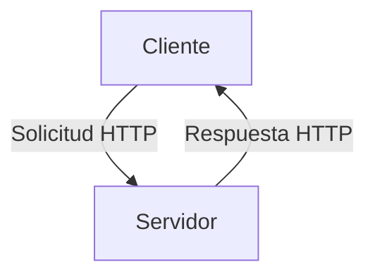
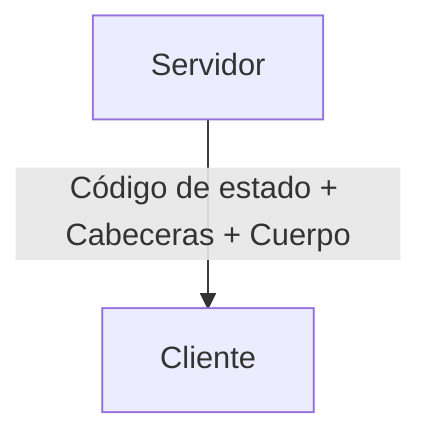

# 🖥️ Laboratorio 1: Explorando HTTP con Herramientas Prácticas

## 📜 Requisitos

Para llevar a cabo este laboratorio, necesitarás las siguientes herramientas:

### cURL
Este laboratorio está pensado para ejecutar comandos en la consola de Linux si usas. Para **macOS** y **Windows** puedes emplear su versión de `curl`, que viene instalada por defecto. Ten en cuenta que su sintaxis es ligeramente distinta a la de Linux.  

También puedes usar la versión web de [curl](https://reqbin.com/curl) si no viene instalado por defecto en tu SO.

### WGet
En Linux, `WGet` viene instalado por defecto.
En **Windows** y **macOS** no viene instalado por defecto.  
- En **Windows**, puedes descargarlo desde el siguiente enlace: [WGet para Windows](https://eternallybored.org/misc/wget/).  
- En **macOS**, puedes instalarlo fácilmente con el siguiente comando si tienes Homebrew:  
  ```bash
  brew install wget
  ```

### Postman
Usaremos la herramiento `Postman`, la puedes descargar aquí para su SO:

- [Postman](https://www.postman.com/downloads/) o una alternativa como [Hoppscotch](https://hoppscotch.io/)
  
  Puedes usar Postman en la web sin instalar nada, por si no lo tienes instalado o no lo puedes instalar en los ordenadores del laboratorio. [Postman online](https://blog.postman.com/announcing-postman-for-the-web-now-in-open-beta/)
  
---

## 📌 Objetivos
En este laboratorio aprenderás a:

- Entender el protocolo HTTP y sus principales características.
- Realizar peticiones HTTP con `curl` y Postman.
- Explorar métodos HTTP: `GET`, `POST`, `PUT`, `DELETE`.
- Analizar cabeceras HTTP en respuestas y peticiones.
- Interactuar con una API REST pública.


---

## 🌐 Conceptos Clave

### 📜 Estructura de una Petición HTTP



Una petición HTTP se compone de:

- **Línea de petición**: Método, URL y versión de HTTP.
- **Cabeceras**: Información adicional sobre la solicitud.
- **Cuerpo (opcional)**: Datos enviados en `POST`, `PUT`, etc.

### 📥 Respuestas HTTP



- **Código de estado**: Indica el resultado (200 OK, 404 Not Found, etc.).
- **Cabeceras**: Información como tipo de contenido o caché.
- **Cuerpo**: Datos devueltos en `HTML`, `JSON`, `XML`, etc.

---

## 🔍 Explorando HTTP con `curl`


### ¿Qué es `cURL`?

cURL es una herramienta de línea de comandos que permite transferir datos desde o hacia un servidor utilizando diversos protocolos, como HTTP, HTTPS y FTP. Es ampliamente utilizada para realizar solicitudes web y probar APIs directamente desde la terminal. Algunos de los modificadores más comunes incluyen:

- `-X` o `--request`: especifica el método HTTP a utilizar (GET, POST, PUT, DELETE, etc.).
- `-H` o `--header`: permite enviar encabezados HTTP personalizados.
- `-d` o `--data`: envía datos en una solicitud POST.
- `-o` o `--output`: guarda la respuesta en un archivo en lugar de mostrarla en la terminal.
- `-I` o `--head`: obtiene solo los encabezados de la respuesta.
- `-v` o `--verbose`: proporcionando información adicional sobre el proceso de transferencia. Muestra información detallada sobre la conexión, incluyendo detalles como la resolución DNS, la negociación SSL/TLS, los encabezados HTTP enviados y recibidos, y otros datos relevantes para la depuración y análisis de la comunicación con el servidor.
  
Para obtener una lista completa de los modificadores y opciones disponibles, puedes consultar la página del manual de cURL ejecutando `man curl` en la terminal, o utilizar `curl --help` para ver una lista resumida de las opciones.

A continuación, se muestra un ejemplo básico de cómo utilizar cURL para realizar una solicitud GET a una página web:

```bash
curl https://www.google.com
```

Este comando recuperará el contenido de la página de inicio de "www.google.com" y lo mostrará en la terminal. 

A continuación vamos a realizar algunas peticiones HTTP con `curl`. Abre una terminal y sigue las instrucciones. 

Para cada respuesta de las que hagamos queremos que seas capaz de responder a las siguientes preguntas:

- ¿Qué **dirección IP** ha resuelto `curl` para el host?  
- ¿Qué **protocolo HTTP** se está utilizando en la comunicación?  
- ¿Cuál es el **código de estado HTTP** de la respuesta y qué indica sobre el resultado de la solicitud?  
- ¿Cuál es el **tamaño** del contenido devuelto en la respuesta?  
- ¿Qué tipo de contenido (`Content-Type`) devuelve el servidor?  
- ¿Qué información indica el encabezado `Accept` en la petición?  
- ¿Cuántas solicitudes pueden hacerse antes de alcanzar el límite de uso?  
- ¿Qué **nueva información** ha añadido/modificado/eliminado el servidor a los datos que enviamos?  
- ¿Qué encabezados indican si la respuesta puede ser almacenada en caché?  
- ¿Qué información adicional proporciona el servidor sobre sí mismo en los encabezados?  


### 1️⃣ Realizar una petición `GET`
Ejecuta en la terminal:
```bash
curl -v https://jsonplaceholder.typicode.com/posts/1
```

### 2️⃣ Simular un `POST`

Puedes cambiar a tu gusto los datos del `POST` por lo que quieras.

#### Si usus Linux o MacOS, puedes usar el siguiente comando para simular un `POST`:
```bash
curl -v -X POST https://jsonplaceholder.typicode.com/posts \
     -H "Content-Type: application/json" \
     -d '{"title": "Nuevo post", "body": "Contenido del post", "userId": 1}'
```

#### Si usas Windows:
```bash
curl -v -X POST https://jsonplaceholder.typicode.com/posts ^
     -H "Content-Type: application/json" ^
     -d "{""title"": ""Nuevo post"", ""body"": ""Contenido del post"", ""userId"": 1}"
```

Al ejecutar la petición `POST`, obtenemos una respuesta detallada del servidor. Analiza la información contenida en la respuesta y responde a las siguientes preguntas:

Responde a estas preguntas analizando la respuesta completa de `curl` y reflexiona sobre su significado.


### 3️⃣ Probar `PUT` y `DELETE`
```bash
curl -X PUT https://jsonplaceholder.typicode.com/posts/1 \
     -H "Content-Type: application/json" \
     -d '{"id": 1, "title": "Título actualizado", "body": "Contenido actualizado", "userId": 1}'
```
```bash
curl -X DELETE https://jsonplaceholder.typicode.com/posts/1
```
Analiza las respuestas obtenidas.

---

## 🚀 Usando Postman para Inspeccionar HTTP

1. **Abrir Postman** y crear una nueva petición.
2. **Seleccionar método HTTP** (`GET`, `POST`, etc.).
3. **Ingresar URL** (ejemplo: `https://jsonplaceholder.typicode.com/posts` ).
4. **Enviar la solicitud que hemos hecho con `curl`**
5. **Analizar la respuesta** y compararla con la obtenida con `curl`.

---

## 🛠️ Explorando otras APIs Pública

Utilizaremos la API pública de [Rick and Morty](https://rickandmortyapi.com/):

1️⃣ Realizar un `GET` para obtener un personaje:
```bash
curl https://rickandmortyapi.com/api/character/1
```
2️⃣ Explorar la respuesta JSON y sus datos.
3️⃣ Probar otros endpoints de la API.

Repite el proceso con Postman.

---

# Ejercicio

Hay un repositorio llamado [Public APIs](https://github.com/public-apis/public-apis) (pincha en él para acceder) que recopila APIs públicas de diferentes categorías. Elige una API que te interese y realiza una petición `GET` para obtener datos de la misma. Analiza la respuesta y comparte tus hallazgos con tus compañeros.

En este caso lo complicado no hacer una petición con `curl` o Postman, sino leer la documentación de la API en cuestión y saber cual es la dirección URL a la que debes hacer la petición y qué datos esperar en la respuesta.

A este dirección URL se le llama **endpoint**.

---
## WGet

`wget` es una herramienta de línea de comandos en Linux que permite la descarga de archivos desde la web mediante los protocolos HTTP, HTTPS y FTP. Es especialmente útil para transferencias no interactivas, como la descarga de archivos o la creación de espejos de sitios web completos. citeturn0search12

**Principales modificadores de `wget`:**

- `-r` o `--recursive`: activa la descarga recursiva, permitiendo descargar un sitio web completo siguiendo los enlaces internos.
- `-l` o `--level=NUMBER`: establece la profundidad máxima de recursión; por defecto, es 5.
- `-k` o `--convert-links`: convierte los enlaces para que funcionen localmente, útil para navegar por el sitio descargado sin conexión.
- `-p` o `--page-requisites`: descarga todos los elementos necesarios para que una página se muestre correctamente, como imágenes y hojas de estilo.
- `-P` o `--directory-prefix=PREFIX`: especifica el directorio donde se guardarán los archivos descargados.

**Ejemplo básico: Descargar una única página web**

Para descargar una sola página web y los recursos necesarios para su correcta visualización:

```bash
wget -p https://www.ejemplo.com/pagina.html
```

Este comando descargará `pagina.html` junto con las imágenes, hojas de estilo y otros recursos asociados, almacenándolos en el directorio actual.

**Ejemplo avanzado: Descargar un sitio web de forma recursiva**

Para descargar un sitio web completo de manera recursiva, conservando la estructura de enlaces para su navegación offline:

```bash
wget -r -k -p -P ./mi_sitio https://www.ejemplo.com
```

Este comando realizará lo siguiente:

- `-r`: Descarga recursiva de todo el sitio.
- `-k`: Convierte los enlaces para que apunten a los archivos locales, facilitando la navegación sin conexión.
- `-p`: Descarga todos los elementos necesarios para la correcta visualización de cada página.
- `-P ./mi_sitio`: Guarda todos los archivos en el directorio `./mi_sitio`.

De esta manera, obtendrás una copia local completa del sitio web, almacenada en el directorio especificado, lista para ser navegada sin conexión.

Para más información y opciones avanzadas, puedes consultar la documentación oficial de `wget`. 

## Ejemplo de utilización de `wget`

Vamos a usar la web del curso para hacer pruebas con `wget`. 

(https://ajgallego.github.io/programacion-web/)[https://ajgallego.github.io/programacion-web/]

Para descargar una única página web y los recursos necesarios para su correcta visualización, puedes utilizar el siguiente comando:

```bash
wget -p -k -P ./mi_pagina https://ajgallego.github.io/programacion-web/
```

Este comando realiza las siguientes acciones:

- `-p`: Descarga todos los elementos necesarios para que la página se muestre correctamente, como imágenes y hojas de estilo.
- `-k`: Convierte los enlaces para que funcionen localmente, facilitando la navegación sin conexión.
- `-P ./mi_pagina`: Guarda los archivos descargados en el directorio `./mi_pagina`.

Para descargar el sitio web de forma recursiva, incluyendo todas las páginas enlazadas y manteniendo la estructura de directorios, puedes utilizar el siguiente comando:

```bash
wget -r -l inf -k -p -P ./mi_sitio https://ajgallego.github.io/programacion-web/
```

Este comando realiza las siguientes acciones:

- `-r`: Activa la descarga recursiva, permitiendo descargar el sitio completo siguiendo los enlaces internos.
- `-l inf`: Establece la profundidad de recursión a infinita, asegurando que se descarguen todas las páginas enlazadas.
- `-k`: Convierte los enlaces para que funcionen localmente, facilitando la navegación sin conexión.
- `-p`: Descarga todos los elementos necesarios para que cada página se muestre correctamente, como imágenes y hojas de estilo.
- `-P ./mi_sitio`: Guarda todos los archivos descargados en el directorio `./mi_sitio`.

De esta manera, obtendrás una copia local completa del sitio web, almacenada en el directorio especificado, lista para ser navegada sin conexión. 


### Comprobar el funcionamiento de WGET

Accede al directorio `./mi_sitio` o el directorio que hayas elegido para la descarga de la web y comprueba que los archivos se han descargado correctamente. Puedes abrir el archivo HTML principal en un navegador para ver cómo se ve la página web sin conexión.


