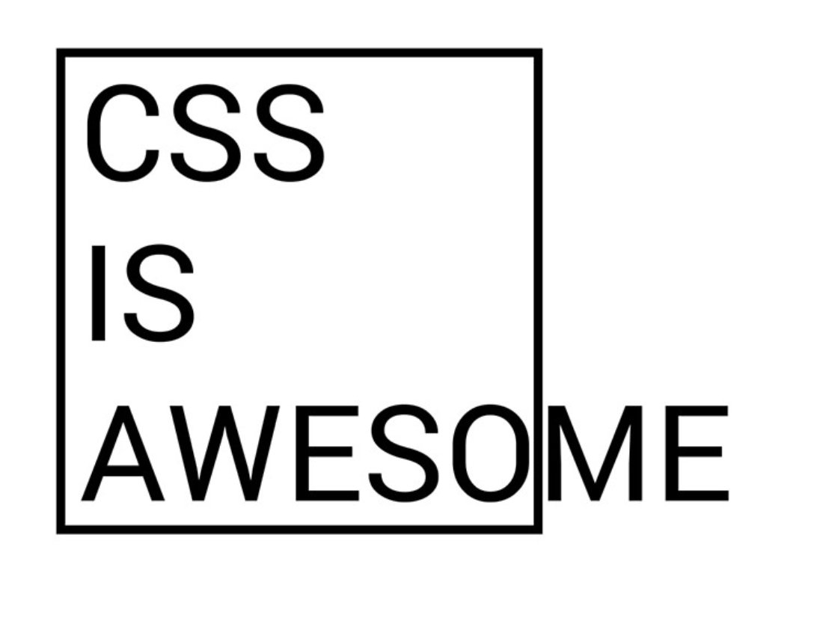
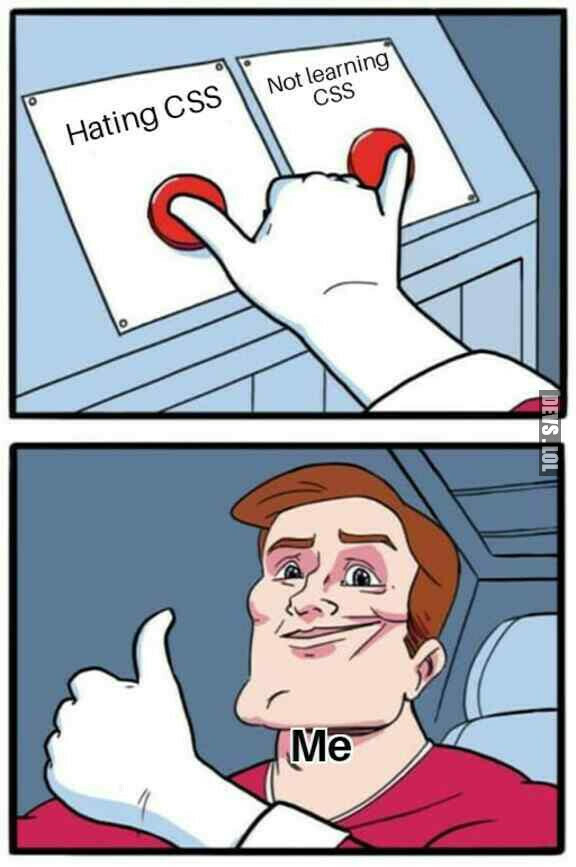

# 🖌️ Laboratorio 3 de CSS: Estilizando una Página Web

## Introducción 📖

En este laboratorio, aprenderemos a aplicar estilos CSS a una página web base utilizando diversas técnicas de diseño. Se proporcionará un archivo HTML ya estructurado que contiene contenido sobre los fundamentos de las tecnologías de la información, personajes ilustres y conceptos clave de programación. Nuestro objetivo será darle estilo mediante hojas de estilo en cascada (CSS) para mejorar su apariencia y presentación.

<div align="center">
    
</div>


## ¿Cómo lo haremos? 🛠️

1. **Exploraremos el HTML base** para entender su estructura.
2. **Crearemos una hoja de estilos CSS** externa para organizar mejor los estilos.
3. **Aplicaremos reglas CSS** para mejorar la tipografía, colores, disposición y presentación de los elementos.
4. **Utilizaremos Flexbox y Grid** para organizar mejor los elementos en la página.
5. **Realizaremos ejercicios y desafíos** para reforzar los conceptos aprendidos.

## Materiales 📂

Para comenzar, descarga el siguiente archivo ZIP que contiene el código HTML y las imágenes necesarias:

📥 **[Descargar archivos del laboratorio](./code/code-lab03.zip)**

📦 El contenido del ZIP incluye:
- `index.html`: Página web base sin estilos.
- `img/`: Carpeta con las imágenes referenciadas en el HTML.


### ⚠️ **Disclaimer: CSS3 en acción, no en diseño** ⚠️

En este laboratorio, aprenderemos a usar **CSS3** para dar estilo a las páginas web, pero **no nos enfocaremos en hacer diseños bonitos y llamativos**. Nuestro objetivo es mostrar el funcionamiento de las propiedades y técnicas clave, por lo que los estilos que proponemos pueden no ser los más atractivos visualmente.  

💡 **¡Desafío para ti!** Te invitamos a mejorar los estilos y hacerlos más vistosos y atractivos. Experimenta con colores, fuentes y disposición para darle un toque más profesional a tu diseño. ¡La creatividad es tu límite! 🚀

## 🎨 Estilizando los encabezados con CSS

En este laboratorio, vamos a modificar el estilo de las etiquetas `<h1>`, `<h2>` y `<h3>` en nuestra página web para darles un aspecto más elegante. Comenzaremos aplicando estilos **inline** y luego exploraremos **mejores prácticas** con CSS.

### ✏️ Primera aproximación: estilos inline

Podemos añadir estilos directamente dentro de las etiquetas utilizando el atributo `style`. Aunque esto funciona, **no es la mejor práctica**, ya que dificulta el mantenimiento del código.

```html
<h1 style="color: navy; font-family: Georgia, serif; text-align: center;">Laboratorio 3: CSS</h1>
<h2 style="color: darkred; font-family: Arial, sans-serif; border-bottom: 2px solid darkred;">Fundamentos de las Tecnologías de la Información</h2>
<h3 style="color: darkslategray; font-style: italic;">Explorando los pilares de la informática y la programación.</h3>
```

⚠️ **Problema:** Si necesitamos cambiar el estilo en el futuro, tendremos que modificar cada etiqueta una por una. ¡Nada eficiente!

---

### 🏛️ Mejorando con CSS en `<style>`

La solución recomendada es utilizar la etiqueta `<style>` dentro del `<head>`:

```html
<style>
    h1 {
        color: navy;
        font-family: Georgia, serif;
        text-align: center;
    }

    h2 {
        color: darkred;
        font-family: Arial, sans-serif;
        border-bottom: 2px solid darkred;
    }

    h3 {
        color: darkslategray;
        font-style: italic;
    }
</style>
```

🔹 **Ventaja:** Ahora los estilos están organizados y podemos modificarlos fácilmente en un solo lugar.

⚠️ **Nuevo problema:** ¡Todos los `<h2>` se ven iguales! Pero solo queremos que el primer `<h2>`, es decir, **"Fundamentos de las Tecnologías de la Información"**, tenga un estilo especial.

---

### 🎯 Solución: usar un **id** o una **clase**

#### Opción 1: Usar un **id** (cuando solo queremos modificar un elemento específico)
Podemos agregar un `id` al `<h2>` deseado y luego referenciarlo en CSS:

```html
<h2 id="fundamentos">Fundamentos de las Tecnologías de la Información</h2>
```

```css
#fundamentos {
    color: darkred;
    font-family: Arial, sans-serif;
    border-bottom: 3px solid crimson;
    background-color: #f8f8f8;
    padding: 10px;
    border-radius: 5px;
}
```

#### Opción 2: Usar una **clase** (cuando podríamos reutilizar el estilo en más de un elemento)
Si más adelante queremos aplicar este mismo estilo a otros elementos, en vez de `id`, usamos `class`:

```html
<h2 class="destacado">Fundamentos de las Tecnologías de la Información</h2>
```

```css
.destacado {
    color: darkred;
    font-family: Arial, sans-serif;
    border-bottom: 3px solid crimson;
    background-color: #f8f8f8;
    padding: 10px;
    border-radius: 5px;
}
```

📌 **Conclusión:**  
- Si el estilo es **único**, usa `id`.  
- Si quieres reutilizarlo, usa `class`.  
- Evita los estilos inline en proyectos grandes.  


## 🎨 Modificando el Estilo de los Primeros Párrafos

En esta sección aprenderemos a modificar el estilo de los tres primeros párrafos de nuestro documento HTML. Usaremos `class` en CSS para cambiar:

✅ **El color del texto** a un tono oscuro pero no negro.  
✅ **La tipografía** a una fuente más estilosa, como *Palatino Linotype* o *Helvetica*.  
✅ **El tamaño de la fuente** a un valor mayor para mejorar la legibilidad.  

### 1️⃣ Modificar el HTML

Para aplicar estilos específicos a los tres primeros párrafos, añadimos una clase llamada `.primeros-parrafos` a cada uno de ellos en el archivo `index.html`:

```html
<p class="primeros-parrafos">La historia de la informática se remonta a dispositivos mecánicos ancestrales, como la <a href="https://es.wikipedia.org/wiki/Mecanismo_de_Anticitera" target="_blank"><strong>Máquina de Anticitera</strong></a>, un mecanismo de engranajes descubierto en un naufragio en Grecia y datado en el siglo II a.C...</p>

<p class="primeros-parrafos">Durante la revolución industrial, surgieron máquinas más avanzadas, como la <a href="https://es.wikipedia.org/wiki/M%C3%A1quina_anal%C3%ADtica" target="_blank"><strong>Máquina Analítica</strong></a> de Charles Babbage en el siglo XIX...</p>

<p class="primeros-parrafos">En el siglo XX, la computación electrónica revolucionó la informática con dispositivos como el <a href="https://es.wikipedia.org/wiki/ENIAC" target="_blank"><strong>ENIAC</strong></a>...</p>
```

### 2️⃣ Definir el Estilo en CSS

Ahora, en el archivo CSS, agregamos la siguiente regla para estilizar los párrafos:

```css
.primeros-parrafos {
    color: #333333; /* Color oscuro, pero no negro */
    font-family: "Palatino Linotype", "Helvetica", sans-serif; /* Fuente estilosa */
    font-size: 1.2em; /* Aumentar el tamaño del texto */
    line-height: 1.6; /* Espaciado entre líneas para mejor legibilidad */
}
```

#### 🔍 Explicación de los Estilos

- `color: #333333;` → Define un tono oscuro para el texto sin ser negro puro (`#000000`).
- `font-family: "Palatino Linotype", "Helvetica", sans-serif;` → Usa *Palatino Linotype* como primera opción, si no está disponible se usará *Helvetica* y, en última instancia, cualquier fuente `sans-serif`.
- `font-size: 1.2em;` → Hace que el tamaño del texto sea un 20% más grande que el tamaño por defecto.
- `line-height: 1.6;` → Agrega espacio entre líneas para una mejor legibilidad.


## 🎨 Reto: Enlaces Estilosos con Iconos Interactivos

En este reto, mejorarás la apariencia de los enlaces en los tres primeros párrafos de la página web. Además, agregarás iconos dinámicos que cambiarán al pasar el ratón por encima. 

### 📌 Requisitos:

1. **Estilizar los enlaces** para que sean más atractivos visualmente.
2. **Agregar un icono** al lado de cada enlace.
3. **Hacer que el icono cambie** al pasar el cursor sobre el enlace.

### 🔧 Instrucciones:

1. **Modifica el CSS** para que los enlaces tengan:
   - Un color atractivo.
   - Un subrayado elegante.
   - Un efecto de transformación cuando el usuario pase el cursor.

2. **Usa pseudo-elementos** (`::before` o `::after`) para añadir los iconos a los enlaces.
   
3. **Cambia los iconos dinámicamente** usando `:hover`.

### Me pregunto de dónde podrías obtener información sobre pseudo-elementos `::before`, `::after` o `:hover` 🤔

[Pincha aquí y te enseño dónde buscar.](https://just-fucking-google.vercel.app?s=::before%20::after%20:hover&e=fingerxyz)


<details>
    <summary>¿Aún quieres ver cómo se haría?</summary>
<br>

Aquí te dejo el código CSS por si te atascas.


> [!WARNING]
> Recuerda: **Nadie gana un Campeonato Mundial de Fórmula 1 sin antes haber conducido un kart.**
> **Deberías intentarlo por tu cuenta.**

<br>

<div align="center">
    
</div>

<br>
<br>

### 🎯 Código sugerido:

#### 📄 **CSS**
```css
p a {
    color: #0077cc;
    text-decoration: none;
    font-weight: bold;
    position: relative;
    transition: color 0.3s ease-in-out;
}

p a::after {
    content: " 🔗";
    font-size: 0.9em;
    transition: content 0.3s ease-in-out;
}

p a:hover {
    color: #ff6600;
    text-decoration: underline;
}

p a:hover::after {
    content: " ⚡";
}
```

### ✅ **Resultado esperado:**
- Los enlaces tendrán un color azul atractivo.
- Un icono de 🔗 aparecerá al final de cada enlace.
- Al pasar el ratón, el enlace cambiará de color y el icono cambiará a ⚡.

¡Pruébalo y experimenta con otros iconos o efectos para personalizar aún más el diseño! 🚀

</details>


---

## 🎨 Estilización de la lista de personajes ilustres

En este ejercicio aprenderemos a estilizar títulos, listas desordenadas y ordenadas, y a incluir imágenes y iconos para mejorar la presentación de información en nuestra página web.


### 🔹 Paso 1: Estilizando el título `<h2>`

El primer paso es aplicar estilos al título de la sección **"Personajes Ilustres en la Informática"**. Queremos que tenga el siguiente estilo:

- **Color del texto**: `#0077cc` (azul intenso).
- **Tamaño de fuente**: `24px`.
- **Alineación del texto**: centrado.
- **Borde inferior**: `3px` sólido de color `#0077cc` (mismo tono de azul que el texto).
- **Espaciado inferior** (`padding-bottom`): `5px`, para separar el texto del borde inferior.


¿Qué tipo de selector deberías usar? 🤔

---

### 🔹 Paso 2: Estilizando las listas (`ul` y `ol`)

Ahora daremos estilo a las listas desordenadas y ordenadas, agregando márgenes y personalizando los elementos.

## 📋 Estilos para listas

### 🔸 Estilos para `ul` (listas no ordenadas)
- **Tipo de viñetas**: `square` (cuadradas).
- **Espaciado izquierdo** (`padding-left`): `20px`.
- **Fuente**: `Arial, sans-serif`.

### 🔹 Estilos para `ol` (listas ordenadas)
- **Tipo de numeración**: `decimal-leading-zero` (números con un `0` inicial, ej. 01, 02, 03...).
- **Espaciado izquierdo** (`padding-left`): `20px`.
- **Fuente**: `Arial, sans-serif`.

### 🧩 Estilos para `li` (elementos de la lista)
- **Espaciado inferior** (`margin-bottom`): `5px` entre elementos.
- **Tamaño de fuente**: `18px`.


📌 **Tarea**: Modifica la hoja de estilos CSS.

✔ **¿Notas la diferencia entre las listas ordenadas y desordenadas?**  
**❗ Pista**: Esto es independiente del CSS, ya que depende del tipo de lista en HTML (`<ul>` vs `<ol>`). Prueba a cambiar `<ul>` por `<ol>` en el HTML

---

### 🔹 Paso 3: Usando una imagen como viñeta (bullet) en la lista

Ahora vamos a hacer algo más visual: **usaremos una imagen en lugar de las viñetas predeterminadas** de la lista.

📌 **Tarea**: Asegúrate de que tienes una imagen pequeña, por ejemplo, `bullet.jpg`, en la carpeta `img/`. ¡Ojo! No uses una imagen enorme.


### 🧠 Reto: Cambiar el estilo de los enlaces y texto de las listas

¿Te atreves a cambiar el estilo de los enlaces y el texto de las listas? 🤔

## 🖌️ Laboratorio de CSS: Modificación de Listas Ordenadas

Vamos a rediseñar la lista ordenada que sigue al encabezado **"Conceptos Clave en Programación"** dentro del código HTML proporcionado. 

## 🎨 Cambio de Estilo para el `h2`
Antes de modificar la lista, vamos a mejorar la apariencia del `h2`:

### 🔹 Objetivo:
- Cambiar el color del texto.
- Aplicar una sombra sutil.
- Convertirlo a mayúsculas.


---

## 📜 Ejercicios: Modificar la Lista Ordenada

Modificaremos la lista `<ol>` que contiene los conceptos clave de programación.

### 🏛️ 1. Usar números romanos
**Objetivo:** Mostrar la lista en números romanos en lugar de números árabes.

**Resultado esperado:**
```
I. Estructuras de Datos
II. Algoritmos
III. Compiladores
IV. Bases de Datos
```

**Pista:** quizá quieres investigar sobre `list-style-type` en CSS.

---

### 🔄 2. Cambiar el orden de la lista
**Objetivo:** Mostrar la lista en orden inverso.

**Resultado esperado:**
```
4. Bases de Datos
3. Compiladores
2. Algoritmos
1. Estructuras de Datos
```


**Pista:** quizá quieres investigar sobre el atributo `reversed` en `<ol>`.

---

### 🏁 3. Iniciar la lista en 50
**Objetivo:** Hacer que la numeración comience en 50.

```css
ol {
    counter-reset: list-counter 49;
    list-style: none;
}
ol li {
    counter-increment: list-counter;
}
ol li::before {
    content: counter(list-counter) ". ";
}
```

**Resultado esperado:**
```
50. Estructuras de Datos
51. Algoritmos
52. Compiladores
53. Bases de Datos
```

**Pista:** quizá quieres investigar sobre `counter-reset`, `counter-increment` en CSS.

---


## 📖 Estilos de Tablas con CSS

En este manual aprenderemos a estilizar tablas en HTML utilizando **CSS**. Se explorarán distintas opciones para:
- Centrar la tabla en la página.
- Definir anchos fijos y automáticos de columnas.
- Aplicar alineaciones personalizadas a las celdas.
- Alternar colores en filas pares e impares.

### 📄 Cambiar el estilo al `h2` antes de la tabla.
Deberías saber sobradamente cómo cambiar el estilo de un `h2` en CSS. Si no, te recomiendo que vuelvas a repasar los ejercicios anteriores.

### 🎯 1. Seleccionar la Tabla en CSS
Para comenzar, aplicaremos una clase a nuestra tabla en el HTML:

```html
<table class="styled-table">
```

Luego, en el archivo CSS, utilizamos la clase `.styled-table` para darle estilos.

---

### 🏛️ 2. Centrar la Tabla en la Página
Podemos centrar la tabla utilizando **margin auto** y asegurarnos de que no ocupe todo el ancho:

```css
.styled-table {
    margin: 0 auto; /* Centra la tabla */
    border-collapse: collapse; /* Une los bordes */
    width: 80%; /* Ajusta el ancho de la tabla */
}
```

Si queremos que ocupe el **100% del ancho disponible**, eliminamos la restricción de `width: 80%`.

---

### 📏 3. Ancho de Columnas
Podemos definir tamaños fijos o permitir que se ajusten automáticamente:

```css
.styled-table th, .styled-table td {
    padding: 10px;
    text-align: left; /* Alineación predeterminada */
}

/* Estableciendo anchos fijos */
.styled-table th:nth-child(1) { width: 30%; }  /* Columna "Lenguaje" */
.styled-table th:nth-child(2) { width: 40%; }  /* Columna "Paradigma" */
.styled-table th:nth-child(3) { width: 30%; }  /* Columna "Año de Creación" */
```

Si queremos que las columnas **se ajusten al contenido**, podemos usar:

```css
.styled-table {
    table-layout: auto;
}
```

Para que todas las columnas tengan el mismo tamaño:

```css
.styled-table {
    table-layout: fixed;
}
```

---

### 📌 4. Alineación de Texto en Celdas
Podemos alinear el contenido de las columnas de distintas formas:

```css
/* Alinear todo el texto al centro */
.styled-table th, .styled-table td {
    text-align: center;
}

/* Alinear a la derecha la columna de años */
.styled-table td:nth-child(3) {
    text-align: right;
}
```

🧭 Otros valores posibles:
- `left` → Izquierda
- `right` → Derecha
- `center` → Centro

---

### 🎨 5. Alternar Colores en Filas
Para mejorar la legibilidad, aplicamos **colores alternos** a las filas:

```css
.styled-table tr:nth-child(even) { 
    background-color: #f2f2f2; /* Color claro para filas pares */
}

.styled-table tr:nth-child(odd) { 
    background-color: #ffffff; /* Color blanco para filas impares */
}
```

Si queremos destacar aún más los encabezados:

```css
.styled-table thead {
    background-color: #333;
    color: white;
    font-weight: bold;
}
```

---

### 🎨 6. Bordes y Estilo Visual
Para un mejor diseño, aplicamos estilos a los bordes:

```css
.styled-table, .styled-table th, .styled-table td {
    border: 1px solid black;
    border-collapse: collapse;
}
```

Podemos suavizar los bordes:

```css
.styled-table th, .styled-table td {
    border: 1px solid #ddd;
    padding: 8px;
}
```

---

## 🌟 7. Tabla con Estilos Avanzados

```css
.styled-table {
    margin: 20px auto;
    width: 90%;
    border-collapse: collapse;
    table-layout: auto;
}

.styled-table th, .styled-table td {
    padding: 12px;
    border: 1px solid #ddd;
}

.styled-table thead {
    background-color: #222;
    color: white;
    text-align: center;
}

.styled-table tbody tr:nth-child(even) {
    background-color: #f8f8f8;
}

.styled-table tbody tr:hover {
    background-color: #ddd;
    cursor: pointer;
}
```

---
 
### 🚀 ¡Experimenta y Personaliza!

¿Te animarías a cambiar el estilo de la tabla y experimentar con diferentes propiedades CSS? Prueba a modificar los colores, fuentes, tamaños y alineaciones para crear una tabla única y atractiva. ¡La creatividad es tu límite!

--- 

## 📸 Diseño de la Sección "Imágenes Representativas" con Flexbox

Para este ejercicio vamos a trabajar con la sección de **"Imágenes Representativas Flexbox"** en la página web. Aprenderemos a utilizar **Flexbox** para organizar las imágenes en una cuadrícula adaptable y atractiva.

### 🤔 ¿Por qué usar Flexbox?

Si colocamos una lista de imágenes sin ningún estilo, el navegador las mostrará una debajo de otra en forma de bloque, lo que no es visualmente atractivo. Si quisiéramos verlas alineadas horizontalmente, podríamos intentar definir manualmente cuántas imágenes colocar por fila, por ejemplo, 3 o 4, pero este enfoque tiene un problema: ¿qué ocurre si el usuario tiene una pantalla más ancha o más estrecha? El diseño no se adaptaría de forma automática y algunas imágenes podrían quedar mal distribuidas o fuera de la pantalla. Este método no es **responsive**, ya que depende de un número fijo de elementos por fila. Para solucionar esto, utilizamos **Flexbox**, que distribuye automáticamente las imágenes en filas según el espacio disponible, garantizando una presentación adaptable sin necesidad de cálculos manuales. 📐✨


### ❌ Un intento fallido: imágenes en línea sin Flexbox

Antes de aplicar **Flexbox**, podríamos intentar alinear las imágenes horizontalmente usando `display: inline-block` o flotándolas con `float: left`. Sin embargo, esto no es una solución óptima, ya que no se adapta bien a distintos tamaños de pantalla y puede generar problemas de alineación. 

Aplica a la sección de las fotos la siguiente clase:

```html
<section class="imagenes-no-flex">
    ...
</section>
```

Y añade este CSS para ver el problema:

```css
.imagenes-no-flex img {
    display: inline-block;
    width: 200px; /* Tamaño fijo */
    height: auto;
    margin: 5px;
}
```


### 🧾 Explicación del estilo CSS `.imagenes-no-flex img`

- **Selector `.imagenes-no-flex img`**:  
  Aplica estilos a todas las imágenes `` dentro de un contenedor con la clase `.imagenes-no-flex`.

- **`display: inline-block;`**  
  - Hace que las imágenes se comporten como elementos en línea, pero con características de bloque.  
  - Permite ajustar su tamaño y margen sin ocupar todo el ancho disponible.

- **`width: 200px;`**  
  - Establece un ancho fijo de 200 píxeles para todas las imágenes.  
  - Garantiza uniformidad en el tamaño de las imágenes dentro del contenedor.

- **`height: auto;`**  
  - Mantiene la proporción original de la imagen.  
  - Evita que la imagen se deforme al ajustar su tamaño.

- **`margin: 5px;`**  
  - Añade un espacio de 5 píxeles alrededor de cada imagen.  
  - Separa las imágenes entre sí, mejorando la estética y legibilidad.


### 🚨 ¿Qué pasa aquí?
- Las imágenes son uniformes, con un ancho fijo de 200px.
- Las imágenes quedan en línea, pero **si la pantalla es muy estrecha, algunas se salen del área visible**.
- Si la pantalla es más ancha, se desperdicia espacio porque las imágenes no se redistribuyen dinámicamente.
- No hay control sobre la alineación y la disposición cambia en diferentes tamaños de pantalla, haciendo que el diseño sea inconsistente.

🔍 **Conclusión**: Este método no es una solución adaptable (*responsive*). Es por eso que necesitamos **Flexbox** para distribuir las imágenes de manera fluida y eficiente en cualquier tamaño de pantalla. 📱💡


### 🎯 Objetivos
- Uniformar el tamaño de las imágenes para una presentación ordenada.
- Usar Flexbox para organizar la distribución de las imágenes.

### 🛠️ 1. Estructura HTML
Vamos a asociar a la sección de imágenes la clase `.imagenes-representativas` 

```html
<section class="imagenes-representativas">
    ...
</section>
```

---

### 🎨 2. Aplicando Flexbox en CSS
Creamos un contenedor flexible que distribuya las imágenes en filas y garantice su alineación:

```css
.imagenes-representativas {
    display: flex;
    flex-wrap: wrap;
    justify-content: center;
    gap: 16px;  /* Espaciado entre imágenes */
}

.imagenes-representativas figure {
    flex: 1 1 300px; /* Distribución flexible con un tamaño base */
    text-align: center;
    max-width: 320px; /* Límite de tamaño */
}

.imagenes-representativas img {
    width: 100%;
    height: auto; /* Mantiene la proporción */
    border-radius: 8px; /* Bordes redondeados */
    box-shadow: 2px 2px 10px rgba(0, 0, 0, 0.1); /* Sombra suave */
}

```


---

### ✅ 3. Explicación de la Solución `.imagenes-representativas`

- **Selector `.imagenes-representativas`**  
  - Se aplica al contenedor principal de las imágenes representativas.
  - Organiza los elementos hijos en un diseño flexible.

- **`display: flex;`**  
  - Activa el modelo de caja flexible (Flexbox).
  - Permite organizar los elementos internos de forma adaptable.

- **`flex-wrap: wrap;`**  
  - Hace que los elementos hijos pasen a la siguiente línea si no caben en una sola fila.

- **`justify-content: center;`**  
  - Centra horizontalmente los elementos dentro del contenedor.

- **`gap: 16px;`**  
  - Añade un espacio de 16 píxeles entre los elementos hijos.

---

### 🧾 Explicación del estilo CSS `.imagenes-representativas figure`

- **Selector `.imagenes-representativas figure`**  
  - Se aplica a los elementos `<figure>` dentro del contenedor principal.

- **`flex: 1 1 300px;`**  
    La propiedad `flex` es un **atajo** de tres valores en el modelo **Flexbox**, equivalente a:

    ```css
    flex: grow shrink basis;
    ```

    Aplicándolo a `flex: 1 1 300px;`:

    1. **`flex-grow: 1;`**  
    - Permite que el elemento crezca si hay espacio disponible.  
    - Si hay más espacio en el contenedor, este elemento se expandirá para ocuparlo.

    2. **`flex-shrink: 1;`**  
    - Permite que el elemento se reduzca si el espacio es insuficiente.  
    - Si hay menos espacio del necesario, el elemento se encogerá para ajustarse.

    3. **`flex-basis: 300px;`**  
    - Establece el **tamaño base inicial** del elemento antes de aplicar crecimiento (`grow`) o reducción (`shrink`).  
    - En este caso, el ancho base de cada `<figure>` es de **300 píxeles**, pero puede aumentar o disminuir dependiendo del espacio disponible.

    #### **Ejemplo de comportamiento**
    - Si el contenedor tiene suficiente espacio, cada `<figure>` intentará medir **300px** de ancho pero puede expandirse gracias a `flex-grow: 1;`.
    - Si el espacio es limitado, los elementos se **comprimirán** proporcionalmente debido a `flex-shrink: 1;`, manteniendo un diseño adaptable.

    En resumen, `flex: 1 1 300px;` crea elementos flexibles con un tamaño base de **300 píxeles**, que pueden **crecer** si hay espacio o **encogerse** si hay restricciones, asegurando una distribución óptima en la cuadrícula. 🚀

    - **`text-align: center;`**  
    - Centra el contenido del `<figure>`, incluyendo texto y elementos gráficos.

    - **`max-width: 320px;`**  
    - Limita el ancho máximo del `<figure>` a 320 píxeles.

---

### 🧾 Explicación del estilo CSS `.imagenes-representativas img`

- **Selector `.imagenes-representativas img`**  
  - Se aplica a las imágenes dentro del contenedor.

- **`width: 100%;`**  
  - Hace que la imagen ocupe todo el ancho del `<figure>`.

- **`height: auto;`**  
  - Mantiene la proporción de la imagen al redimensionarse.

- **`border-radius: 8px;`**  
  - Redondea las esquinas de la imagen con un radio de 8 píxeles.

- **`box-shadow: 2px 2px 10px rgba(0, 0, 0, 0.1);`**  
  - Añade una sombra suave alrededor de la imagen.
  - Da un efecto de elevación y profundidad sutil.

---

### 🚀 ¡Experimenta y Personaliza!

---

## 📚 CSS Grid: Diseño Avanzado en la Web  

Para este ejercicio vamos a trabajar con la sección de **"Imágenes Representativas CSS Grid"** en la página web. Aprenderemos a utilizar **CSS Grid** para organizar las imágenes en una cuadrícula adaptable y atractiva.

### 🎯 Introducción a CSS Grid  

**CSS Grid** es un sistema de diseño en CSS que permite estructurar elementos en una cuadrícula bidimensional, organizando filas y columnas con gran flexibilidad. 🏗️  

A diferencia de **Flexbox**, que trabaja en una sola dimensión (fila o columna), **Grid** nos da un control completo sobre la disposición de los elementos en ambas direcciones, facilitando el diseño de páginas web complejas y adaptables.  

🔹 **Ventajas de CSS Grid:**  
- Permite definir diseños de **múltiples filas y columnas** sin necesidad de contenedores adicionales.  
- Facilita la **alineación y distribución de elementos** sin depender de márgenes o posiciones manuales.  
- Se adapta fácilmente a **diseños responsivos** mediante `auto-fit` y `auto-fill`.  
- Mejora la legibilidad del código CSS al separar estructura y estilo.  

---

### 🆚 Grid vs Flexbox: ¿Cuál usar?  

Tanto **Grid** como **Flexbox** son herramientas poderosas, pero tienen usos diferentes.  

| Característica        | Grid                                  | Flexbox                              |
|----------------------|----------------------------------|----------------------------------|
| **Estructura**       | Bidimensional (filas y columnas)  | Unidimensional (fila o columna)  |
| **Distribución**     | Control total sobre la cuadrícula | Se adapta dinámicamente         |
| **Complejidad**      | Más adecuado para layouts completos | Ideal para componentes individuales |
| **Espaciado**        | Usa `gap` para separar elementos  | Usa `margin` y `justify-content` |
| **Flujo de contenido** | Se organiza en una cuadrícula definida | Se distribuye según el contenido |

👉 **Usa Grid** para estructuras de página completas (layouts, galerías de imágenes).  
👉 **Usa Flexbox** para distribuir elementos dentro de un contenedor (botones, menús, formularios).  

---

### 📸 Diseño de la Sección "Imágenes Representativas" con CSS Grid  

Vamos a usar **Grid** para crear una distribución adaptable de imágenes con columnas dinámicas.  

Te propongo que copies el código de las imágenes para comparar lo que hicimos con `Flexbox` y lo que haremos con `Grid`.

Pero en la nueva sección de imágenes, vamos a usar la clase **"imagenes-representativas-grid"**. 📸

```html
<section class="imagenes-representativas-grid">
    ...
</section>
```

#### 🎨 Aplicando CSS Grid  

```css
.imagenes-representativas-grid {
    display: grid;
    grid-template-columns: repeat(auto-fit, minmax(250px, 1fr));
    gap: 16px;
    justify-items: center;
    padding: 20px;
}

.imagenes-representativas-grid figure {
    text-align: center;
    max-width: 300px;
}

.imagenes-representativas-grid img {
    width: 100%;
    height: auto;
    border-radius: 8px;
    box-shadow: 2px 2px 10px rgba(0, 0, 0, 0.1);
}
```

---

#### 🔍 Explicación del CSS  

| Propiedad                      | Explicación |
|---------------------------------|------------|
| `display: grid;` | Activa el sistema de cuadrícula. |
| `grid-template-columns: repeat(auto-fit, minmax(250px, 1fr));` | Crea columnas flexibles de mínimo 250px, expandiéndose según el ancho disponible. |
| `gap: 16px;` | Añade espacio entre elementos. |
| `justify-items: center;` | Centra las imágenes dentro de la cuadrícula. |
| `padding: 20px;` | Agrega un margen interno para mejor presentación. |
| `max-width: 300px;` | Limita el tamaño máximo de cada figura. |
| `border-radius: 8px;` | Aplica esquinas redondeadas a las imágenes. |
| `box-shadow: 2px 2px 10px rgba(0, 0, 0, 0.1);` | Añade una sombra suave. |

---

#### 🎯 Ventajas del diseño con Grid  

✅ **Las imágenes se distribuyen dinámicamente** sin importar el tamaño de la pantalla.  
✅ **El diseño se adapta automáticamente**, manteniendo una presentación limpia.  
✅ **No necesitamos media queries** para la mayoría de los ajustes responsivos.  
✅ **El código es más limpio** y fácil de entender.  

---

#### 🚀 Comparación final  

| Característica        | Flexbox                              | Grid                                  |
|----------------------|----------------------------------|----------------------------------|
| **Disposición**      | Unidimensional (fila o columna)  | Bidimensional (filas y columnas) |
| **Distribución automática** | Solo en una dirección       | En ambas direcciones            |
| **Ideal para**       | Botones, menús, formularios      | Diseños completos, galerías     |
| **Código más claro** | Sí, en estructuras simples      | Sí, en layouts completos        |

💡 **Conclusión**:  
- Si necesitas **distribuir elementos en una sola línea**, usa **Flexbox**.  
- Si necesitas **crear un layout complejo con filas y columnas**, usa **Grid**.  

---

#### 🎯 ¡Pruébalo por tu cuenta!   

Copia el código y experimenta con diferentes tamaños de pantalla. 📱💻  

¡CSS Grid te permitirá crear diseños flexibles, modernos y profesionales con menos esfuerzo! 🚀🎨  

## 🏆 Ejercicio: Crear una Cuadrícula Flexible de 3 Columnas con CSS Grid  

### 🧐 El Problema  

Queremos mejorar la sección de **imágenes representativas** aplicando **CSS Grid** para organizarlas en filas con un **máximo de 3 elementos por fila**.  

🔍 **Requisitos:**  
- Cada fila debe contener hasta **3 imágenes**.  
- Las imágenes deben ajustarse dinámicamente al ancho disponible, **creciendo o reduciéndose** según el tamaño de la pantalla.  
- Debemos garantizar un **espaciado uniforme** entre los elementos.  
- Las imágenes deben **mantener su proporción** y ocupar el **máximo tamaño posible** dentro de su celda.  

💡 **Objetivo:**  
Queremos lograr un diseño atractivo, adaptable y fácil de mantener utilizando **CSS Grid**.  

---

## 🔬 ¿Qué conceptos de CSS debemos estudiar?  

Para resolver este problema, es importante comprender las siguientes propiedades de **CSS Grid**:  

1️⃣ **`display: grid;`** → Activa el sistema de cuadrícula.  

2️⃣ **`grid-template-columns: repeat(3, 1fr);`** → Define **3 columnas iguales**, lo que garantiza que haya **máximo 3 elementos por fila**.  

3️⃣ **`auto-fit` vs `auto-fill`** → Nos permiten controlar la cantidad de columnas dinámicas en función del espacio disponible.  

4️⃣ **`minmax()`** → Permite definir un **tamaño mínimo y máximo** para los elementos, asegurando que crezcan o se reduzcan adecuadamente.  

5️⃣ **`gap`** → Controla el **espaciado** entre los elementos de la cuadrícula.  

6️⃣ **`object-fit: cover;`** → Permite que las imágenes llenen su contenedor sin distorsionarse.  

---

## 🎯 ¿Qué características serían deseables?  

Para un diseño óptimo, debemos asegurarnos de que:  

✔️ Las imágenes **no se estiren ni deformen** al ajustarse.  
✔️ La cuadrícula se mantenga ordenada, sin importar el número de imágenes.  
✔️ La presentación sea **responsiva**, adaptándose bien en diferentes tamaños de pantalla.  
✔️ Se conserve un **espaciado uniforme** entre las imágenes.  

---

## 🎨 Retos: ¿Te atreves con ellos?


### 1️⃣ **Cambio del Fondo de la Página**  

En este ejercicio, queremos mejorar la apariencia visual de la web cambiando el fondo de toda la página para que no sea blanco, sino un tono crema claro. Este cambio permitirá que el contenido sea más agradable a la vista y que la lectura sea más cómoda en diferentes dispositivos.  

#### **Requerimientos:**  
1. Se debe modificar el color de fondo **de toda la web**, asegurando que no quede ninguna sección con el color blanco por defecto.  
2. El nuevo color de fondo debe ser un **tono crema claro**, que proporcione un buen contraste con el texto para mantener la legibilidad.  
3. El cambio debe aplicarse de manera que se mantenga en todas las secciones de la web, independientemente del tamaño de la pantalla o del dispositivo en el que se visualice.  
4. Es recomendable elegir un color que armonice con el resto de los elementos de la página, evitando que afecte negativamente la visibilidad del contenido.  

💡 **Pista:** Piensa en cómo definir un color de fondo que afecte a toda la página sin necesidad de aplicarlo individualmente a cada elemento. Considera cómo se puede definir de manera global para que el diseño sea consistente en todas las vistas.  

### 2️⃣ **Estructura de Página con Diseño de Periódico**  

El objetivo de este ejercicio es mejorar la presentación de la página para que tenga un aspecto más similar al de un periódico digital. Actualmente, el contenido ocupa todo el ancho de la pantalla en dispositivos grandes, pero queremos que tenga un diseño más equilibrado y fácil de leer.  

#### **Requerimientos:**  
1. La página debe estar **centrada** en la pantalla cuando se visualice en dispositivos con pantallas anchas.  
2. Se deben agregar **márgenes a ambos lados** del contenido para que no se extienda de extremo a extremo de la ventana.  
3. El contenido debe ocupar un ancho adecuado para facilitar la lectura, sin quedar demasiado estrecho en pantallas grandes.  
4. En dispositivos más pequeños (como móviles o tablets), la página debe **adaptarse automáticamente**, asegurando que el contenido siga siendo accesible y legible.  

💡 **Pista:** Piensa en cómo limitar el ancho del contenido y centrarlo en la pantalla sin afectar su capacidad de ajustarse en dispositivos más pequeños.  ¿A qué elemento de la página HTML deberías aplicarle el estilo?


### 3️⃣ **Organización de Secciones en la Página**  

En este ejercicio, se requiere organizar visualmente tres secciones dentro de un mismo contenedor para que se distribuyan de manera proporcional en la página.  

#### **Requerimientos:**  
1. Se cuenta con tres bloques de contenido dentro de un mismo contenedor principal:  
   - **Personajes Ilustres en la Informática**  
   - **Conceptos Clave en Programación**  
   - **Tabla de Comparación**  

2. Es necesario distribuir estos bloques en la misma línea horizontal, respetando la siguiente proporción de espacio en la página:  
   - La primera y la segunda sección deben ocupar el **25% del ancho** cada una.  
   - La tercera sección debe ocupar el **50% del ancho** restante.  

3. Las secciones deben mantener esta distribución sin importar el tamaño de la pantalla, asegurando una correcta adaptación en distintos tamaños de visualización.  

4. Se debe evitar el uso de valores absolutos en el ancho de los elementos y procurar que el contenedor principal tenga un mecanismo para distribuir el espacio de manera flexible entre los elementos.  

💡 **Pista:** Piensa en cómo distribuir el espacio disponible entre los elementos de forma proporcional dentro de su contenedor.  


Después de completar este laboratorio, entenderás este meme. 😄

<div align="center">
    
</div>