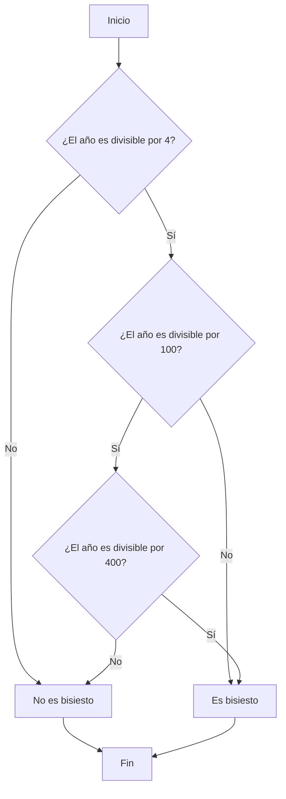
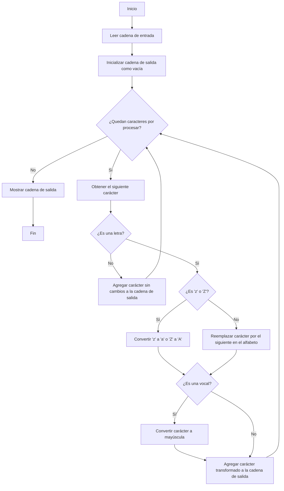

# 🏋️ Ejercicios JavaScript

## ✨ Objetivos del laboratorio

El propósito de este laboratorio es que practiques la programación de algoritmos utilizando JavaScript, partiendo de un conjunto de ejercicios. No se trata solo de escribir código que funcione, sino de aplicar un **proceso sistemático de desarrollo** que te ayude a resolver problemas de forma ordenada, eficiente y profesional.

## 🧠 Antes de programar... piensa

Programar **no es solo escribir código**, sino resolver problemas. Y para resolver problemas, hay un **proceso mental** que debemos seguir antes de abrir el editor:

1. **Leer el enunciado con atención** 📄  
   > Es la fase de **Toma de requisitos**. ¿Qué nos están pidiendo? ¿Qué datos se nos dan? ¿Qué resultados se esperan?

2. **Entender el problema** 🤔  
   > Equivale al **Análisis**. ¿Qué casos pueden darse? ¿Qué limitaciones tiene el problema?

3. **Plantear una solución lógica** 🧩  
   > Esta es la fase de **Diseño**. Pensamos cómo resolverlo con un algoritmo, qué pasos seguir, y qué estructuras de datos emplear.

4. **Programar la solución** 💻  
   > Aquí comienza la **Implementación** en JavaScript. Escribimos el código basándonos en el diseño previo.

5. **Probar y depurar** 🧪  
   > Por último, llega la fase de **Pruebas**. Verificamos que el código funciona para todos los casos posibles, incluidos los límites o casos especiales.


### 🤖 ¿Y la inteligencia artificial?

Vivimos en un momento histórico donde herramientas basadas en inteligencia artificial pueden ayudarnos a programar. Es más: **puedes copiar el enunciado de estos ejercicios y pedírselo directamente a una IA**, y seguramente te devuelva una solución bastante razonable. Los enunciados están redactados de forma clara y precisa, y eso facilita mucho que una IA los entienda. Pero...

> ❗ **Esto no será lo normal en el mundo real.**

En la vida profesional, los problemas no vendrán con enunciados tan bien redactados. Te tocará enfrentarte a requisitos difusos, clientes que no saben expresar lo que quieren o necesidades que cambian sobre la marcha. **Deberás ser capaz de entender el problema, formularlo bien y plantear soluciones viables**.

Y ahora piensa:

> 🧾 ¿Y si la IA se encarga de programar por ti?  
> 💰 ¿Por qué te iban a pagar a ti?  
> 🧠 ¿Cómo justificarás tu salario?

Simplemente piénsalo.

Saber programar no es solo teclear código. Es **entender, razonar, diseñar, validar y corregir**. La IA puede ayudarte en todo ese proceso, pero **no puede hacerlo sin ti**. Por eso, **no debemos saltarnos ninguna fase del desarrollo**.


## 🚦 Antes de empezar: 3 ideas imprescindibles (desde Visual Studio Code)

Antes de lanzarte al Ejercicio 1, hay tres conceptos que te van a ahorrar muchísima frustración cuando empieces a escribir (y sobre todo a depurar) JavaScript.


### 1) 🧠 ¿Cómo se ejecuta un archivo JavaScript? (y por qué no es como Java)

En JavaScript, cuando ejecutas un archivo (por ejemplo con Node.js o en un navegador), el motor **carga y ejecuta el código de arriba hacia abajo**.

Pero hay un matiz importante: el motor hace dos “pasadas” conceptuales:

1. **Fase de creación (preparación)** (a veces se habla de *hoisting*)
    - Se registran **declaraciones de funciones** (p. ej. `function f() {}`) y quedan disponibles “desde el principio”.
    - Se preparan variables declaradas con `var` (existen desde el inicio, pero empiezan con `undefined`).
    - Se preparan `let` y `const`, pero quedan en una zona especial (la **temporal dead zone**) hasta que el flujo de ejecución llega a su línea.

2. **Fase de ejecución (línea a línea)**
    - Se van ejecutando las instrucciones **en el orden en que aparecen**.

✅ La **primera línea que “se ejecuta”** es la primera instrucción del archivo (la primera sentencia ejecutable). Aun así, algunas cosas (como las funciones declaradas) ya existen por el comportamiento anterior.

🔁 Esto es distinto a Java en un punto clave: en Java, en general, el flujo “normal” está dentro de métodos (aunque existan inicializadores y constructores). En JavaScript **sí puedes** escribir sentencias “arriba del todo” y se ejecutan directamente cuando se carga el archivo.

Un detalle importante: aunque **las funciones son valores** (puedes asignarlas a variables), **no es lo mismo** escribir `function f() {}` (declaración) que `const f = function () {}` o `const f = () => {}` (expresión). En el reto de abajo se ve clarísimo.

#### 🎯 Reto (ambicioso y algo “tramposo”): ¿qué orden crees que sigue y qué sale por pantalla?

**Instrucciones (en VS Code):**

1. Crea un archivo llamado, por ejemplo, `reto-orden.js`.
2. Pega este código.
3. Antes de ejecutarlo, escribe en un papel (o comenta en el propio archivo) el orden de los `console.log` y **qué valores** esperas.
4. Ejecútalo con Node.js desde el terminal integrado: `node reto-orden.js`.

> Importante: la gracia del reto es que **parece** que hay un orden obvio… hasta que recuerdas cómo funcionan `var`, `let`, las funciones y el orden real de ejecución.

```js
console.log('1) total al principio:', total);

var total = 0;

console.log('2) total tras inicializar:', total);

function sumarUno(etiqueta) {
   total = total + 1;
   console.log(etiqueta, '→ total =', total);
   return total;
}

console.log('3) llamar a declarada:', declarada());

function declarada() {
   return sumarUno('4) dentro declarada');
}

try {
   console.log('5) llamar a expresion:', expresion());
} catch (e) {
   console.log('5) llamar a expresion: ERROR');
}

var expresion = function () {
   return sumarUno('6) dentro expresion');
};

try {
   {
      console.log('7) bloque antes del let:', total);
      let total = 100;
      console.log('8) bloque despues del let:', total);
   }
} catch (e) {
   console.log('7-8) bloque con let: ERROR');
}

console.log('9) total al final:', total);
sumarUno('10) sumarUno final');
console.log('11) total final final:', total);
```

🧩 Preguntas para pensar (sin mirar soluciones):
- ¿Por qué el `console.log` (1) no revienta si `total` “aún no existe”? ¿Qué valor imprime?
- ¿Por qué `declarada()` funciona antes de su definición y `expresion()` no?
- ¿Qué está pasando dentro del bloque con `let total = 100`?

<details>
    <summary>¿Quieres saber la solución?</summary>
<br>

Por consola obtendremos esto:

```bash
1) total al principio: undefined
2) total tras inicializar: 0
4) dentro declarada → total = 1
3) llamar a declarada: 1
5) llamar a expresion: ERROR
7-8) bloque con let: ERROR
9) total al final: 1
10) sumarUno final → total = 2
11) total final final: 2
```

Explicación:

```js
// NOTA GENERAL: JavaScript ejecuta el archivo de arriba a abajo.
// Lo “sorprendente” aquí viene de:
// - Hoisting de `var`: se eleva (se registra) la *declaración* al inicio del scope,
//   pero la *inicialización* se queda en su línea.
// - Hoisting de `function` (declaraciones): se elevan con su cuerpo completo.
// - `let`: es de bloque y existe una Temporal Dead Zone (TDZ) desde el inicio del
//   bloque hasta su línea de declaración; leerla antes lanza ReferenceError.

// 1) En este punto existe la variable `total` (por hoisting de `var total`),
//    pero aún no está inicializada. Su valor es `undefined`.
//    Resultado en consola: "1) total al principio: undefined"
console.log('1) total al principio:', total);

// 2) Aquí ocurre la inicialización real (la asignación). A partir de aquí `total` vale 0.
var total = 0;

// Resultado en consola: "2) total tras inicializar: 0"
console.log('2) total tras inicializar:', total);

// `sumarUno` es una *function declaration*: está disponible en todo el scope por hoisting.
// Además, tiene efecto lateral: modifica `total`.
function sumarUno(etiqueta) {
   total = total + 1;
   console.log(etiqueta, '→ total =', total);
   return total;
}

// 3) `declarada()` también es una *function declaration*, así que se puede llamar
//    antes de su definición textual.
//    Durante esta llamada:
//    - se ejecuta `sumarUno('4) dentro declarada')`
//    - `sumarUno` incrementa `total` de 0 a 1
//    - imprime primero: "4) dentro declarada → total = 1"
//    - devuelve 1, y entonces se imprime: "3) llamar a declarada: 1"
console.log('3) llamar a declarada:', declarada());

function declarada() {
   return sumarUno('4) dentro declarada');
}

try {
   // 5) `expresion` está declarada con `var`, por lo que *existe* (hoisting),
   //    pero en este punto sigue valiendo `undefined` porque la asignación
   //    (la función) ocurre más abajo.
   //    Llamar `undefined()` lanza TypeError. Se captura y se imprime "ERROR".
   console.log('5) llamar a expresion:', expresion());
} catch (e) {
   console.log('5) llamar a expresion: ERROR');
}

// 6) Recién aquí `expresion` queda inicializada con una función.
//    (Es una *function expression* asignada a una variable, no una declaración.)
var expresion = function () {
   return sumarUno('6) dentro expresion');
};

try {
   {
      // 7-8) Dentro de este bloque, `let total = 100` crea una nueva `total`.
      //      Esa `total` de bloque existe desde el inicio del bloque, pero está
      //      en TDZ hasta la línea del `let`. Por eso *leer `total` aquí* lanza
      //      ReferenceError incluso aunque exista una `total` global.
      //      (La variable global queda “sombreada” por la del bloque.)
      //      Resultado: se salta directamente al `catch` y NO se imprimen 7) ni 8).
      console.log('7) bloque antes del let:', total);
      let total = 100;
      console.log('8) bloque despues del let:', total);
   }
} catch (e) {
   console.log('7-8) bloque con let: ERROR');
}

// 9) `total` sigue valiendo 1 (solo se incrementó dentro de `declarada()`).
//    Resultado: "9) total al final: 1"
console.log('9) total al final:', total);

// 10) Incrementa de 1 a 2 e imprime: "10) sumarUno final → total = 2"
sumarUno('10) sumarUno final');

// 11) Ahora `total` vale 2.
//     Resultado: "11) total final final: 2"
console.log('11) total final final:', total);

```

</details>

#### 🧱 Organización recomendada del código (si solo tienes un fichero `.js`)

Cuando trabajas con **un único archivo** (lo típico en ejercicios), conviene imponer un orden fijo para que el flujo sea fácil de seguir y evitar sorpresas con el *hoisting*.

✅ Regla práctica: **primero defines (datos y funciones), y al final ejecutas**.

**Orden recomendado (de arriba a abajo):**

1. **Constantes y configuración**
   - Usa `const` por defecto (si no cambia, es `const`).
   - Aquí van valores “fijos”: límites, textos, opciones, etc.

2. **Variables de estado (si las hay)**
   - Usa `let` solo si vas a reasignar.
   - Evita `var` para no mezclar scopes y hoisting “confuso”.

3. **Funciones auxiliares / lógica principal**
   - Coloca primero las funciones más pequeñas (helpers) y luego las que las usan.
   - Si una función se usa “antes” en el archivo, que sea porque es **declaración** (`function f() {}`) o, mejor aún, porque **está definida arriba**.
   - ✅ Buena práctica: evita que las funciones **toquen/modifiquen variables globales** (estado externo). Es más fácil de probar y de depurar si una función recibe datos por parámetros y devuelve un resultado.

4. **Punto de entrada (lo primero que “hace cosas”)**
   - Crea una función `main()` (o similar) donde estén las primeras líneas “reales” que se ejecutan: leer datos, llamar a funciones, imprimir resultados.
   - Al final del archivo, llama a `main()`.

Plantilla mínima (para ejercicios):

```js
// 1) Constantes / configuración
const LIMITE = 100;

// 2) Variables (estado)
let contador = 0;

// 3) Funciones
function calcularAlgo(x) {
   return x + LIMITE;
}

function main() {
   const resultado = calcularAlgo(5);
   console.log('Resultado:', resultado);
}

// 4) Ejecución (punto de entrada)
main();
```


### 2) ▶️ ¿Cómo ejecutar JavaScript? (3 escenarios típicos)

En esta asignatura usarás **Visual Studio Code** como herramienta central. Desde ahí, JavaScript suele ejecutarse de tres formas:

1. **Script independiente (lo más común: Node.js)**
    - Ideal para ejercicios, algoritmos y prácticas.
    - Flujo típico en VS Code: crear `archivo.js` → terminal integrado → `node archivo.js`.

2. **JavaScript asociado a una web (lo ejecuta el navegador)**
    - El código se carga desde un `.html` mediante `<script>`.
    - El navegador ejecuta JavaScript y puedes ver los resultados en:
       - La consola de DevTools del navegador.
       - O depurando desde VS Code (ver punto 3).

3. **JavaScript en un servidor web (backend)**
    - Aquí JavaScript corre “del lado del servidor”.
    - Se suele usar **Node.js** o **Deno** para ejecutar el código.
    - Normalmente el servidor se queda “escuchando” peticiones (por ejemplo, en un puerto) en lugar de terminar al instante.


### 3) 🐞 Debugging básico: de `console.log` a depurar en VS Code

Cuando tu código no hace lo que esperas, tienes dos enfoques típicos:

1. **`console.log` (lo más usado, pero limitado)**
    - Es rápido para una comprobación puntual.
    - Pero a la larga es un rollo: ensucia el código, cuesta seguir el flujo y es fácil interpretarlo mal.
    - Además, JavaScript es muy **asíncrono** y orientado a eventos: a veces el orden de los logs engaña, y puedes perder el contexto de “qué se estaba ejecutando” y por qué.

2. **Depurar con Visual Studio Code (recomendado para entender el flujo)**
    - Te permite poner **breakpoints**, ver variables, pila de llamadas (call stack), y avanzar paso a paso.
    - Para depurar un script con Node.js:
       - Ve a **Run and Debug** (panel de depuración).
       - Elige un perfil de **Node.js**.
       - Lanza la ejecución y usa breakpoints.
    - Para depurar JavaScript del navegador:
       - Elige un perfil de depuración del navegador (por ejemplo, Chrome/Edge).
       - Abre la web y depura desde VS Code, no solo desde DevTools.

> Objetivo de este laboratorio: que poco a poco dejes de “adivinar” con logs y empieces a **entender el flujo** con un depurador.


---

## Ejercicio 1 - 🧐 Verificar si una cadena comienza con 'Java'

### 📖 Descripción del ejercicio

Escribe una función en JavaScript que determine si una cadena de texto dada comienza con la palabra 'Java' (sensible a mayúsculas y minúsculas). La función debe devolver `true` si la cadena comienza con 'Java' y `false` en caso contrario.

### ✍️ Entrada

- Una cadena de texto.

### 📤 Salida esperada

- Un valor booleano: `true` si la cadena comienza con 'Java', `false` en caso contrario.

### 🧪 Ejemplos

```javascript
comienzaConJava('JavaScript'); // Resultado esperado: true
comienzaConJava('Java');       // Resultado esperado: true
comienzaConJava('Python');     // Resultado esperado: false
```


### 🧠 Pistas

🔍 Es posible que lo primero que se te ocurra sea extraer los primeros caracteres de la cadena y compararlos con la palabra 'Java'. Sin embargo...

💡 Existe un método más directo y eficiente. Pregúntate:

> ¿Hay algún método en los strings de JavaScript que permita verificar si una cadena comienza con una subcadena específica?

📖 Revisa la documentación oficial sobre los métodos de los strings en JavaScript:

[https://www.w3schools.com/js/js_string_methods.asp](https://www.w3schools.com/js/js_string_methods.asp)

---

## 🧠 Ejercicio 2 - Número más cercano a 100

🎯 **Objetivo:**  
Escribir una función que reciba dos números enteros positivos y devuelva el que esté más próximo a 100.

📥 **Entrada de ejemplo:**
- `90`, `89`

📤 **Salida esperada:**
- `90`

🔍 **Indicaciones:**
- Ambos números serán mayores que 0.
- Si ambos están a la misma distancia de 100, la función puede devolver cualquiera de ellos.

💡 **Pista:**  
Piensa en cómo calcular la **distancia** entre cada número y el 100.

---


## 🗓️ Ejercicio 3 - Determinar si un año es bisiesto en el calendario gregoriano

### Descripción del problema
Un año bisiesto en el calendario gregoriano es aquel que tiene 366 días en lugar de los 365 habituales. Esto se logra añadiendo un día extra al mes de febrero, que pasa a tener 29 días. Los años bisiestos se introdujeron para mantener la sincronización del calendario con el año astronómico o estacional
Para determinar si un año es bisiesto, se siguen estas reglas

1. Si el año es divisible por 4, pasa al paso 2. De lo contrario, no es bisiesto
2. Si el año es divisible por 100, pasa al paso 3. De lo contrario, es bisiesto
3. Si el año es divisible por 400, es bisiesto. De lo contrario, no es bisiesto
Por ejemplo, los años 2000 y 2016 son bisiestos, mientras que 1700, 1800 y 1900 no lo son

### Entrada y salida esperadas

- **Entrada:** Un número entero que representa el año (por ejemplo, 2026)
- **Salida:** Un valor booleano: `true` si el año es bisiesto, `false` en caso contrario

**Ejemplo:**

```javascript
esBisiesto(2026);
```

**Salida esperada:**

```javascript
true
```

### Diagrama de flujo



### ¿Cómo comprobar que tu código funciona?

Hay que hacer pruebas. De momento solo vamos a hacer `smoke tests`, es decir, comprobar que el código no tiene errores de sintaxis. Para ello, puedes copiar el código en la consola del navegador y ejecutarlo.

Las pruebas unitarias las haremos más adelante.

---

## Ejercicio 4 - 🌡️ Conversión de temperaturas entre Celsius y Fahrenheit

### 📝 Enunciado
Escribe un programa en JavaScript que convierta temperaturas entre las escalas Celsius y Fahrenhei.

### 🔍 Descripción

Las escalas Fahrenheit y Celsius son dos sistemas de medida de temperatura ampliamente utilizads.
- **Fahrenheit**: En esta escala, el agua se congela a 32 grados y hierve a 212 grads.- **Celsius**: En esta escala, el agua se congela a 0 grados y hierve a 100 grads.

Las fórmulas de conversión son:
- De Fahrenheit a Celsius:

```math
C = \frac{5}{9} \times (F - 32)
```

- De Celsius a Fahrenheit:

```math
F = C \times \frac{9}{5} + 32
```

### 📥 Entrada esperaa

Un número que represente la temperatura y una indicación de la escala original (Celsius o Fahrenhet).

### 📤 Salida esperda

La temperatura convertida a la escala opuesta, mostrando el valor original y el converido.

### 🧪 Casos de prueba sugerdos


```javascript
convertirTemperatura(60, 'C'); // "60°C son 140°F."
convertirTemperatura(45, 'F'); // "45°F son 7.222°C.
```


---

## Ejercicio 5: 📝 Contar el número de vocales en una cadena

**Objetivo:** Desarrollar una función en JavaScript que cuente cuántas vocales (a, e, i, o, u) hay en una cadena dada

**Instrucciones:**

1. Escribe una función que tome una cadena como entrada y devuelva el número total de vocales presentes en ella
2. Considera que la cadena puede contener letras mayúsculas y minúsculas, así como otros caracteres
3. Ten en cuenta que la solución más inmediata podría ser utilizar un bucle `for` para recorrer cada carácter de la cadena y contar las vocales. Sin embargo, existe una forma más sencilla y eficiente de lograrlo empleando los métodos de cadena y expresiones regulares en JavaScript, que permite obtener el resultado en una sola línea de código

**Pista:**
Investiga cómo utilizar el método `match` de las cadenas junto con expresiones regulares para identificar y contar caracteres específicos en una cadena

<details>
<summary>💡 Solución en una línea de código</summary>

```javascript
const contarVocales = cadena => (cadena.match(/[aeiou]/gi) || []).length;
```

**Nota:** En la solución proporcionada, la expresión regular `/[aeiou]/gi` busca todas las vocales en la cadena sin distinguir entre mayúsculas y minúsculas. El método `match` devuelve un array con todas las coincidencias, y al obtener su longitud con `.length`, se obtiene el número total de vocales. Si no se encuentran vocales, `match` devuelve `null`, por lo que se utiliza `|| []` para asegurar que siempre se trabaje con un array y evitar errore. 

</details>
<br>

**Ejemplo de uso:**

```javascript
console.log(contarVocales("JavaScript")); // Output: 3
console.log(contarVocales("w3resource.com")); // Output: 5
```

---

## 🧪 Ejercicio 6: El número más grande 🔢

### Descripción  
Queremos trabajar con arrays en JavaScript. En este ejercicio deberás implementar una función que reciba un array de números y devuelva el número **más grande** que contiene.

### 🧠 Objetivo  
Practicar el uso de estructuras de datos como arrays y afianzar el uso de bucles o métodos integrados para recorrerlos.

### ✍️ Instrucciones  
1. Crea una función con un nombre descriptivo.
2. Asegúrate de que la función reciba **un solo parámetro**, que será un array de números.
3. La función debe **devolver** el número más grande del array.
4. Puedes asumir que el array tiene al menos un número.

### 🧾 Ejemplo de entrada
```js
[3, 7, 2, 9, 5]
```

### ✅ Salida esperada
```js
9
```


---

## Ejercicio 7: 🔁 Invirtiendo un array

En este ejercicio vamos a trabajar con **arrays en JavaScript**, concretamente con la inversión de su contenido. El objetivo es que el estudiante entienda cómo manipular los elementos de un array utilizando bucles y métodos incorporados del lenguaje.

### 🎯 Objetivo

Dado un array de números, crea un nuevo array con los elementos en orden inverso.

### 📥 Entrada

Un array de números, por ejemplo:

```js
[1, 2, 3, 4, 5]
```

### 📤 Salida esperada

```js
[5, 4, 3, 2, 1]
```


### 🧠 Parte 1: Usando un bucle

Escribe una función que reciba un array y devuelva uno nuevo con los elementos en orden inverso, utilizando un bucle `for` o `while`.

- Puedes usar un array auxiliar donde vayas insertando los elementos.

> ✨ Consejo: Empieza recorriendo el array original desde el último índice hasta el primero.


### ⚙️ Parte 2: Usando el método `.reverse()`

Una vez tengas la solución usando un bucle, intenta hacer lo mismo utilizando el método `reverse()` de los arrays en JavaScript.

> 📚 Puedes consultar cómo funciona este método en la documentación oficial de MDN:  
> [Array.prototype.reverse() - MDN](https://developer.mozilla.org/es/docs/Web/JavaScript/Reference/Global_Objects/Array/reverse)


---

## 🧮 Ejercicio 8 - Cálculo del área de un triángulo a partir de sus tres lados

### ✍️ Enunciado

Escribe una función en JavaScript que reciba **tres números** como parámetros, correspondientes a los tres lados de un triángulo (por ejemplo, `a`, `b` y `c`), y devuelva el **área** del triángulo usando la **fórmula de Herón**.

🔢 **Ejemplo**  
Entrada: lados `a = 5`, `b = 6`, `c = 7`  
Salida esperada: `14.6969...`

---

### 🧠 Pistas

Para resolver este ejercicio, necesitarás:

1. **Calcular el semiperímetro** del triángulo:
   
   📌 Fórmula:

   ```
   s = (a + b + c) / 2
   ```

2. **Aplicar la fórmula de Herón** para obtener el área:

   📌 Fórmula:

   ```
   área = √[s(s - a)(s - b)(s - c)]
   ```

3. Para calcular la raíz cuadrada en JavaScript, puedes usar:

   ```
   Math.sqrt(x)
   ```


---

## 🧠 Ejercicio 9 - Fechas en JavaScript

### 📋 Enunciado

Escribe una función en JavaScript que muestre en consola la **fecha y hora actual** en el siguiente formato:

```
Hoy es: Martes.
Hora actual: 10 PM : 30 : 38
```

🔹 El formato debe indicar:
- El **día de la semana** en español.
- La **hora en formato de 12 horas**, con indicación de AM o PM.
- Los **minutos** y **segundos** actuales.

---

#### 🧠 Pequeño pseudocódigo

```
1. Crear una variable con la fecha actual usando Date()
2. Crear un array con los nombres de los días de la semana
3. Obtener el número de día con getDay() y buscar el nombre en el array
4. Obtener la hora, minutos y segundos
5. Convertir la hora de 24h a 12h y añadir AM o PM
6. Imprimir el mensaje en el formato indicado
```

### 💡 Pistas

#### 📆 Uso del objeto `Date()`

JavaScript tiene un objeto nativo llamado `Date` que nos permite trabajar fácilmente con fechas y horas actuales:

```js
const ahora = new Date();
```

Este objeto tiene métodos para obtener partes específicas de la fecha, como:

- `getDay()` → devuelve el día de la semana (0 es Domingo, 1 es Lunes, ..., 6 es Sábado)
- `getHours()` → devuelve la hora en formato de 24h (de 0 a 23)
- `getMinutes()` → devuelve los minutos
- `getSeconds()` → devuelve los segundos


#### 🗓️ ¿Por qué crear un array con los días de la semana?

Porque el método `.getDay()` devuelve un **número del 0 al 6**, pero tú necesitas mostrar el **nombre del día** (“Lunes”, “Martes”, etc.).

Por eso, lo ideal es usar un array donde el índice corresponda al valor numérico de `getDay()`:

```js
const dias = ['Domingo', 'Lunes', 'Martes', 'Miércoles', 'Jueves', 'Viernes', 'Sábado'];
```

Así, puedes acceder al nombre con:

```js
const nombreDia = dias[ahora.getDay()];
```

---

## Ejercicio 10: 🎄 Días restantes hasta la próxima Navidad

Escribe un programa en JavaScript que calcule el número de días que faltan para la próxima Navidad (25 de diciembre).

**Entrada esperada:**

-La fecha actual

**Salida esperada:**

-Número de días restantes hasta el 25 de diciembre del año en curso

**Pistas:**

- Utiliza el objeto `Date` de JavaScript para obtener la fecha actual y para establecer la fecha de Navidad
- Recuerda que los meses en JavaScript se indexan desde 0 (enero) hasta 11 (diciembre)
- Si la fecha actual es posterior al 25 de diciembre, deberás calcular los días restantes hasta el 25 de diciembre del año siguiente

**Ejemplo de uso del objeto `Date`:**

```javascript
// Obtener la fecha actual
const hoy = new Date();

// Crear un objeto Date para el 25 de diciembre del año actual
const navidad = new Date(hoy.getFullYear(), 11, 25);
```

---


## 🧪 Ejercicio 11: El número más repetido

### Descripción

En este ejercicio trabajarás con arrays y estructuras de datos para analizar la frecuencia de los elementos. El objetivo es encontrar el número que más veces se repite en un array dado.

Si hay varios números con la misma frecuencia máxima, debes devolver **el que aparece primero** entre ellos.

### 🎯 Objetivo

Escribir una función en JavaScript que reciba un array de números y devuelva el número que más veces se repite.

### 📥 Entrada

Un array de números enteros, por ejemplo:

```javascript
[3, 1, 3, 2, 1, 3, 2, 1]
```

### 📤 Salida esperada

```javascript
3
```

### ℹ️ Notas

- Puedes asumir que el array no estará vacío.
- Si hay empate, se devuelve el número que **aparece antes** en el array original con la máxima frecuencia.

### 🧠 Pistas

- Considera usar objetos o estructuras [🗺️ Map](https://developer.mozilla.org/es/docs/Web/JavaScript/Reference/Global_Objects/Map) para contar apariciones.
- Piensa en cómo llevar un seguimiento del orden de aparición mientras calculas frecuencias.

---


## 🧑‍💻 Ejercicio 12: Reemplazar cada carácter en una cadena por el siguiente en el alfabeto
En este ejercicio, desarrollarás una función en JavaScript que toma una cadena de texto y reemplaza cada letra por la siguiente en el alfabeto. Además, las vocales resultantes deben convertirse a mayúscula.

### 📜 Descripción
- Cada letra en la cadena debe ser sustituida por la siguiente letra en el alfabeto. Por ejemplo, 'a' se convierte en 'b', 'b' en 'c', y así sucesivamene.
- Las vocales ('a', 'e', 'i', 'o', 'u') resultantes después de la sustitución deben transformarse a mayúsculs.
- Los caracteres no alfabéticos deben permanecer sin cambis.

### 🔍 Ejemplo

**Entrada**

```
"javascript"
```


**Proceso:** 
1. 'j' →'k'
2. 'a' → 'b' (convertido a mayúscula: B')
3. 'v' →'w'
4. 'a' → 'b' (convertido a mayúscula: B')
5. 's' →'t'
6. 'c' →'d'
7. 'r' →'s'
8. 'i' → 'j' (convertido a mayúscula: J')
9. 'p' →'q'
10. 't' → 'u' (convertido a mayúscula: U')

**Salida**

```
"kBwBtdsJqU"
```


### 🛠️ Instrucciones
1. Crea una función en JavaScript que acepte una cadena de texto como parámtro.
2. Itera sobre cada carácter de la cadena y aplica las transformaciones descritas anteriormnte.
3. Devuelve la nueva cadena transforada.

### 🔑 Puntos a considerar

- Asegúrate de manejar correctamente los límites del alfabeto. Por ejemplo, la letra 'z' debe convertirse e 'a'
- Mantén los caracteres no alfabéticos sin cabios.

### 📈 Diagrama de flujo





---

## 🌐 Ejercicios DOM (en navegador) — 5 ejercicios incrementales

Estos ejercicios se ejecutan en **navegador** y son **reactivos a eventos** (click, input, teclado, carga de página…).

### ✅ Código base (ya preparado)

- Descarga: [Descargar el código base](./code/DOM.zip) 
- Descomprime el zip y coloca la carpeta `DOM` dentro de tu proyecto (por ejemplo, en `labo05.1/code/DOM`).
- Abre en el navegador: `index.html`
- Edita (está vacío a propósito): `script.js`
- Estilos (no hace falta tocarlos): `style.css`

📌 Reglas para estos ejercicios:
- Usa el objeto `document`.
- Usa **casi siempre** `document.getElementById(...)` para obtener elementos.
- Conecta la lógica con `addEventListener(...)` (programación orientada a eventos).
- Para escribir en pantalla, usa preferiblemente `textContent`.

---

### DOM-1) Contador con botones (muy fácil)

**Objetivo:** al pulsar `+1` aumenta el número mostrado; al pulsar `Reset` vuelve a 0.

**IDs a usar:** `btnIncrement`, `btnReset`, `counterValue`

**Requisitos mínimos:**
- `btnIncrement` suma 1 al valor visible en `counterValue`.
- `btnReset` pone `counterValue` a `0`.

---

### DOM-2) Saludo (fácil)

**Objetivo:** leer el nombre escrito y mostrar un saludo.

**IDs a usar:** `nameInput`, `btnGreet`, `greetOutput`

**Requisitos mínimos:**
- Al hacer click en `btnGreet`, leer `nameInput.value`.
- Si está vacío (o solo espacios), mostrar en `greetOutput`: `Escribe un nombre`.
- Si tiene contenido, mostrar: `Hola, NOMBRE!`.

**Extra (recomendado):**
- Al pulsar Enter dentro del input, debe hacer lo mismo que el botón (evento `keydown` o `keyup`).

---

### DOM-3) Validación de email en vivo (medio)

**Objetivo:** validar el email mientras se escribe y habilitar/deshabilitar el botón.

**IDs a usar:** `emailInput`, `emailError`, `btnSubmit`

**Requisitos mínimos:**
- En el evento `input` de `emailInput`, comprobar si el email es válido.
- Si NO es válido:
   - `emailError.textContent = 'Email inválido'`
   - `btnSubmit.disabled = true`
- Si SÍ es válido:
   - `emailError.textContent = ''`
   - `btnSubmit.disabled = false`

**Pista:** un regex razonable para empezar es `^[^\s@]+@[^\s@]+\.[^\s@]+$`.

---

### DOM-4) Lista dinámica con borrar ítems (medio-difícil)

**Objetivo:** añadir elementos a una lista y poder eliminarlos.

**IDs a usar:** `itemInput`, `btnAddItem`, `itemList`, `listHint`

**Requisitos mínimos:**
- Al hacer click en `btnAddItem`:
   - Leer el texto de `itemInput`.
   - Si está vacío, no añadir nada.
   - Si tiene texto, añadir un `<li>` dentro de `itemList`.
   - Vaciar el input al terminar.
- Cada `<li>` debe incluir un botón “Borrar” (por ejemplo, un `<button type="button">Borrar</button>`).
- Al pulsar “Borrar” en un ítem, ese `<li>` desaparece.
- `listHint` debe decir `(La lista está vacía)` cuando no haya elementos y estar vacío cuando sí haya.

**Pista (eventos):** puedes usar un único listener en `itemList` y mirar `event.target` (delegación de eventos).

---

### DOM-5) Nota persistente con `localStorage` (difícil)

**Objetivo:** guardar automáticamente lo escrito y recuperarlo al recargar la página.

**IDs a usar:** `noteArea`, `btnClearNote`, `noteStatus`

**Requisitos mínimos:**
- Al cargar la página (evento `DOMContentLoaded`):
   - Leer una clave de `localStorage` (por ejemplo, `labo05_1_note`).
   - Si existe, poner ese texto en `noteArea.value`.
- En el evento `input` de `noteArea`:
   - Guardar el contenido en `localStorage`.
   - Actualizar `noteStatus` con un mensaje corto, por ejemplo: `Guardado`.
- Al hacer click en `btnClearNote`:
   - Vaciar el textarea.
   - Borrar la clave en `localStorage`.
   - Actualizar `noteStatus` (por ejemplo: `Nota borrada`).


### 🌟 Desafío adicional

Investiga sobre el [**Cifrado César**](https://es.wikipedia.org/wiki/Cifrado_C%C3%A9sar), una técnica de cifrado por sustitución en la que cada letra en el texto es reemplazada por otra letra un número fijo de posiciones más adelante en el alfabeto. ¿Cómo podrías modificar tu función para implementar este tipo de ifrado? 

## 📚 Recursos adicionales

En las siguientes webs puedes encontrar más ejercicios para practicar tus habilidades de programación en JavaScript. Además, en muchos casos se incluyen también las soluciones, por si quieres comparar tu implementación con la propuesta o resolver dudas sobre los ejercicios de este laboratorio:

- 🌐 [W3Schools - JavaScript Exercises](https://www.w3schools.com/js/exercise_js.asp)  
- 🌐 [W3Schools - Más ejercicios de JavaScript](https://www.w3schools.com/JS//js_exercises.asp)  
- 🌐 [W3Resource - JavaScript Exercises](https://www.w3resource.com/javascript-exercises/)
