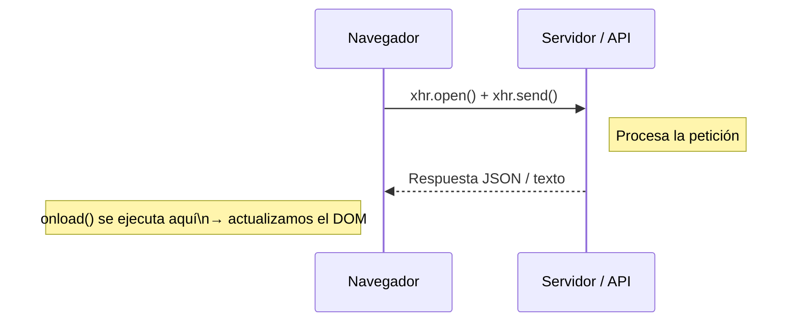

# 🧪 Laboratorio 8: AJAX

---

## 🧭 Introducción al laboratorio

En este laboratorio aprenderás a realizar **peticiones asíncronas** desde el navegador usando JavaScript. Esto es lo que se conoce como AJAX: la técnica que permite que una página web se comunique con un servidor **sin tener que recargar toda la página**.

A lo largo del laboratorio trabajarás con dos formas de hacer AJAX:

1. **`XMLHttpRequest`** — la forma nativa del navegador, más verbosa pero fundamental para entender qué ocurre por debajo.
2. **jQuery AJAX** — una capa de abstracción que simplifica el código considerablemente.

> ⚠️ En el siguiente tema aprenderemos `fetch`, la forma moderna de hacer peticiones asíncronas. Por ahora, en este laboratorio **no usaremos `fetch`**.

🌱 ¡Aprenderás haciendo! No tengas miedo de equivocarte. Cada error en la consola es una pista.


## 🚀 Código de inicio

Para comenzar el laboratorio puedes partir del siguiente fichero base:

- [Código inicio](code/index.html)
  
---

## 1. 🔄 ¿Cómo funciona AJAX?

Antes de escribir código, entiende el flujo:

1. **Ocurre un evento** en la página (clic de botón, carga de la página…)
2. **JavaScript crea** un objeto `XMLHttpRequest`
3. **Se envía la petición** al servidor (o a una API externa)
4. **El servidor responde** con datos (normalmente JSON)
5. **JavaScript recibe** la respuesta y actualiza el DOM — **sin recargar la página**



---

## 2. 🧱 El objeto `XMLHttpRequest` paso a paso

### 2.1 Creando el objeto

```javascript
const xhr = new XMLHttpRequest();
```

Esta línea crea un **objeto** que representa una petición HTTP. Todavía no hace nada: solo lo estamos preparando.

---

### 2.2 El método `open()` — configurar la petición

```javascript
xhr.open("GET", "https://www.themealdb.com/api/json/v1/1/search.php?s=Arrabiata", true);
```

Este método **configura** la petición, pero aún no la envía. Sus parámetros son:

| Parámetro | Valor en el ejemplo | Qué significa |
|---|---|---|
| `método` | `"GET"` | Tipo de petición HTTP (`GET` para leer, `POST` para enviar datos) |
| `url` | `"https://..."` | Dirección del recurso que queremos solicitar |
| `async` | `true` | `true` = asíncrona (recomendado), `false` = bloqueante (evitar) |

> ⚠️ Las peticiones **síncronas** (`false`) bloquean el hilo principal del navegador. La página se congela hasta que llega la respuesta. Siempre usa `true`.

---

### 2.3 El callback `onload` — ¿qué es un callback?

```javascript
xhr.onload = function() {
  // este código se ejecuta CUANDO llega la respuesta
  console.log(xhr.responseText);
};
```

Un **callback** es una función que le pasamos a otra función (o a un objeto) para que se llame en el momento adecuado — en este caso, cuando la petición termine.

Piénsalo así: cuando llamas a un taxi por teléfono, no te quedas en la puerta esperando. Sigues con tu vida y el taxista te **llama de vuelta** cuando llega. Eso es un callback.

```
xhr.send()         → envías la petición y sigues con tu código
...
(tiempo después)
xhr.onload()       → el "taxi" ha llegado, se ejecuta tu función
```

> 💡 El código dentro de `onload` **no se ejecuta en orden** junto con el resto del script. Se ejecuta **cuando la petición finaliza**, que puede ser milisegundos o segundos después.

---

### 2.4 Enviando la petición

```javascript
xhr.send();
```

Esta línea **dispara** la petición. Para peticiones `GET` no necesita argumentos. Para `POST` le pasaremos los datos.

---

### 2.5 Procesando la respuesta JSON

La mayoría de las APIs modernas devuelven datos en formato **JSON** (JavaScript Object Notation). La respuesta llega como un texto plano (`xhr.responseText`), y debemos **convertirlo** a un objeto JavaScript:

```javascript
xhr.onload = function() {
  if (xhr.status >= 200 && xhr.status < 300) {
    const datos = JSON.parse(xhr.responseText); // texto → objeto JS
    console.log(datos);
  }
};
```

`JSON.parse()` convierte la cadena `'{"nombre":"Rick","especie":"Humano"}'` en un objeto con el que puedes hacer `datos.nombre`, `datos.especie`, etc.

---

### 2.6 `readyState` y `status` — el estado de la petición

Durante el ciclo de vida de una petición, `xhr.readyState` va cambiando:

| `readyState` | Significado |
|---|---|
| `0` | Objeto creado, sin inicializar |
| `1` | `open()` ha sido llamado |
| `2` | `send()` ha sido llamado, cabeceras recibidas |
| `3` | Descargando la respuesta |
| `4` | **Petición completada** |

`xhr.status` es el **código de respuesta HTTP**:

| `status` | Significado |
|---|---|
| `200` | OK — éxito |
| `201` | Created — recurso creado (típico en POST) |
| `400` | Bad Request — petición mal formada |
| `401` | Unauthorized — falta autenticación |
| `403` | Forbidden — no tienes permiso |
| `404` | Not Found — el recurso no existe |
| `500` | Internal Server Error — fallo en el servidor |

---

### 2.7 Manejo de errores

Una petición puede fallar de dos formas distintas:

```javascript
const xhr = new XMLHttpRequest();
xhr.open("GET", "https://api.ejemplo.com/datos", true);

// ① Error HTTP (servidor responde, pero con código de error)
xhr.onload = function() {
  if (xhr.status >= 200 && xhr.status < 300) {
    const datos = JSON.parse(xhr.responseText);
    console.log("Datos:", datos);
  } else {
    console.error(`Error del servidor: ${xhr.status} ${xhr.statusText}`);
  }
};

// ② Error de red (no hay conexión, la URL no existe, CORS…)
xhr.onerror = function() {
  console.error("Error de red: no se pudo conectar");
};

// ③ Timeout (el servidor no respondió a tiempo)
xhr.timeout = 5000; // 5 segundos
xhr.ontimeout = function() {
  console.error("El servidor tardó demasiado en responder");
};

xhr.send();
```

> 💡 **Importante**: `onerror` **no** se dispara cuando el servidor responde con 404 o 500. Esos son errores HTTP que se gestionan dentro de `onload` comprobando `xhr.status`. `onerror` solo se dispara cuando hay un **fallo de red** (sin conexión, CORS, etc.).

---

## 3. 🐱 Ejemplo guiado: obtener una foto de gato

Analiza este ejemplo completo antes de hacer los ejercicios:

```html
<!DOCTYPE html>
<html lang="es">
<head>
  <meta charset="UTF-8">
  <title>Foto de gato</title>
</head>
<body>
  

  <script>
    // ① Creamos el objeto
    const xhr = new XMLHttpRequest();

    // ② Configuramos: método GET, URL de la API, asíncrona
    xhr.open("GET", "https://api.thecatapi.com/v1/images/search", true);

    // ③ Definimos el callback: qué hacer cuando llegue la respuesta
    xhr.onload = function() {
      if (xhr.status === 200) {
        // La API devuelve un array: [ { url: "...", width: ..., height: ... } ]
        const datos = JSON.parse(xhr.responseText);
        document.getElementById("fotoGato").src = datos[0].url;
      }
    };

    xhr.onerror = function() {
      console.error("No se pudo conectar con la API");
    };

    // ④ Enviamos la petición
    xhr.send();
  </script>
</body>
</html>
```

### 🔍 Analiza el código

Antes de continuar, responde estas preguntas mirando el código:

- ¿En qué línea se **crea** el objeto XHR?
- ¿En qué línea se **define** el callback? ¿Y cuándo se **ejecuta**?
- ¿Qué devuelve la API? ¿Es un objeto o un array? ¿Por qué accedemos a `datos[0]`?
- ¿Qué pasaría si quitamos la condición `if (xhr.status === 200)`?

---

## 4. 🚫 CORS y la política de mismo origen (Same-Origin Policy)

El navegador aplica una política de seguridad que **restringe** las peticiones AJAX a dominios diferentes al de la página actual. Esto se llama **Same-Origin Policy (SOP)**.

Por ejemplo, si tu página está en `http://localhost` e intentas hacer una petición a `http://otro-dominio.com`, el navegador la **bloquea** — aunque la petición llegue al servidor, la respuesta no se entrega a tu código JavaScript.

Para que una API permita peticiones desde otros orígenes, debe incluir cabeceras **CORS** (Cross-Origin Resource Sharing) en su respuesta, como:

```
Access-Control-Allow-Origin: *
```

> 📌 **Lo verás en acción en el ejercicio 3.** Cuando hagas una petición a una API que no tiene CORS habilitado, el error aparecerá en la **consola del navegador**, no en tu código.

---

## 5. 📤 Peticiones POST y `FormData`

Para **enviar datos** al servidor usamos el método `POST`. Si queremos enviar archivos (imágenes, documentos), usamos `FormData`:

```javascript
function subirImagen() {
  const fileInput = document.getElementById("imagenGato");
  const file = fileInput.files[0]; // el archivo seleccionado

  if (!file) {
    alert("Por favor selecciona una imagen primero");
    return;
  }

  // FormData empaqueta el archivo como si fuera un formulario HTML
  const formData = new FormData();
  formData.append("file", file); // nombre del campo, valor

  const xhr = new XMLHttpRequest();
  xhr.open("POST", "https://api.thecatapi.com/v1/images/upload", true);

  // Cabecera de autenticación (API key)
  xhr.setRequestHeader("x-api-key", "TU_API_KEY");

  xhr.onload = function() {
    if (xhr.status === 201) { // 201 = Created
      const respuesta = JSON.parse(xhr.responseText);
      console.log("Imagen subida:", respuesta.url);
    } else {
      console.error("Error al subir:", xhr.statusText);
    }
  };

  xhr.onerror = function() {
    console.error("Error de conexión");
  };

  // Con FormData NO ponemos Content-Type manualmente
  // El navegador lo establece automáticamente con el boundary correcto
  xhr.send(formData);
}
```

> 💡 **¿Por qué no ponemos `Content-Type` con FormData?** Cuando usas `FormData`, el navegador necesita generar una cabecera especial del tipo `multipart/form-data; boundary=---abc123...` con un identificador único. Si lo pones tú manualmente sin el `boundary`, el servidor no podrá parsear el cuerpo.

---

## 6. ✨ jQuery y AJAX

jQuery simplifica enormemente el código necesario para hacer peticiones AJAX. Veamos la comparativa:

### Con `XMLHttpRequest` (nativo):

```javascript
const xhr = new XMLHttpRequest();
xhr.open("GET", "https://api.thecatapi.com/v1/images/search", true);
xhr.onload = function() {
  if (xhr.status === 200) {
    const datos = JSON.parse(xhr.responseText);
    document.getElementById("fotoGato").src = datos[0].url;
  }
};
xhr.onerror = function() { console.error("Error"); };
xhr.send();
```

### Con `$.ajax()` de jQuery:

```javascript
$.ajax({
  url: "https://api.thecatapi.com/v1/images/search",
  method: "GET",
  success: function(datos) {
    // jQuery ya parsea el JSON automáticamente si la API devuelve JSON
    $("#fotoGato").attr("src", datos[0].url);
  },
  error: function(xhr, status, error) {
    console.error("Error:", error);
  }
});
```

Mucho más limpio, ¿verdad? jQuery se encarga de:
- Detectar que la respuesta es JSON y parsearla automáticamente.
- Separar el manejo de éxito (`success`) y error (`error`).
- Gestionar la compatibilidad entre navegadores.

---

### 6.1 Parámetros principales de `$.ajax()`

| Parámetro | Descripción |
|---|---|
| `url` | Dirección a la que se envía la petición |
| `method` (o `type`) | `"GET"`, `"POST"`, etc. |
| `data` | Datos a enviar al servidor |
| `dataType` | Tipo de dato esperado (`"json"`, `"text"`, etc.) |
| `headers` | Cabeceras HTTP adicionales (p.ej. API keys) |
| `success` | Función que se ejecuta si la petición tiene éxito |
| `error` | Función que se ejecuta si la petición falla |
| `complete` | Se ejecuta siempre, haya éxito o error |
| `timeout` | Tiempo máximo de espera en milisegundos |
| `processData` | Si es `false`, no convierte `data` a query string (necesario con FormData) |
| `contentType` | Si es `false`, deja que el navegador ponga el Content-Type (necesario con FormData) |

---

### 6.2 Métodos abreviados de jQuery

jQuery ofrece atajos para los casos más comunes:

```javascript
// GET que espera JSON
$.getJSON("https://api.example.com/datos", function(datos) {
  console.log(datos);
});

// POST
$.post("https://api.example.com/crear", { nombre: "Rick", ciudad: "Citadel" }, function(respuesta) {
  console.log(respuesta);
});
```

> 📌 **Nota sobre `$.getJSON()`**: es exactamente lo mismo que `$.ajax({ method: "GET", dataType: "json", ... })`, pero escrito de forma más corta.

---

### 6.3 Subir archivos con jQuery

Cuando queremos subir archivos con jQuery, hay que deshabilitar dos comportamientos automáticos:

```javascript
$.ajax({
  url: "https://api.thecatapi.com/v1/images/upload",
  method: "POST",
  headers: { "x-api-key": "TU_API_KEY" },
  data: formData,
  processData: false, // NO conviertas FormData a query string
  contentType: false, // NO pongas Content-Type (el navegador lo gestiona)
  success: function(respuesta) {
    console.log("Subido:", respuesta.url);
  },
  error: function(xhr) {
    console.error("Error:", xhr.statusText);
  }
});
```

---

## 7. 🏋️ Ejercicios

### 🔧 Preparación

Para todos los ejercicios, parte de este HTML base:

```html
<!DOCTYPE html>
<html lang="es">
<head>
  <meta charset="UTF-8">
  <title>Laboratorio AJAX</title>
  <!-- Para los ejercicios de jQuery, incluye esto: -->
  <!-- <script src="https://code.jquery.com/jquery-3.6.4.min.js"></script> -->
</head>
<body>
  <h1>Laboratorio AJAX</h1>
  <div id="resultado"></div>

  <script>
    // Tu código aquí
  </script>
</body>
</html>
```

---

### 🔹 Ejercicio 1 — Tu primera petición GET (receta de cocina)

Crea una página HTML con un botón "Buscar receta". Al hacer clic, debe hacer una petición GET a la API de **TheMealDB** y mostrar en el `div#resultado` el **nombre** y las **instrucciones** del primer resultado.

URL de la API: `https://www.themealdb.com/api/json/v1/1/search.php?s=Arrabiata`

La respuesta tiene esta estructura:

```json
{
  "meals": [
    {
      "strMeal": "Spicy Arrabiata Penne",
      "strInstructions": "Bring a large pot of water to a boil...",
      ...
    }
  ]
}
```

**Pistas:**
- Necesitarás un botón con un `addEventListener("click", ...)`
- Usa `JSON.parse(xhr.responseText)` para acceder a los datos
- Accede a la primera receta con `datos.meals[0]`

---

<details>
  <summary>Ver solución ejercicio 1 👀</summary>
<br>

> [!WARNING]
> Recuerda: **Nadie ganó un Roland Garros viendo jugar a Rafa Nadal por la TV.**  
> **Deberías intentarlo por tu cuenta.**

```html
<!DOCTYPE html>
<html lang="es">
<head>
  <meta charset="UTF-8">
  <title>Receta</title>
</head>
<body>
  <button id="buscar">Buscar receta</button>
  <div id="resultado"></div>

  <script>
    document.getElementById("buscar").addEventListener("click", function() {
      const xhr = new XMLHttpRequest();
      xhr.open("GET", "https://www.themealdb.com/api/json/v1/1/search.php?s=Arrabiata", true);

      xhr.onload = function() {
        if (xhr.status >= 200 && xhr.status < 300) {
          const datos = JSON.parse(xhr.responseText);
          const receta = datos.meals[0];
          document.getElementById("resultado").innerHTML =
            `<h2>${receta.strMeal}</h2><p>${receta.strInstructions}</p>`;
        } else {
          document.getElementById("resultado").textContent = "Error: " + xhr.status;
        }
      };

      xhr.onerror = function() {
        document.getElementById("resultado").textContent = "Error de conexión";
      };

      xhr.send();
    });
  </script>
</body>
</html>
```

</details>
<br>

---

### 🔹 Ejercicio 2 — Observar el `readyState`

Crea una petición GET a cualquier API (puedes usar la del ejercicio 1) y muestra por consola el valor de `xhr.readyState` **en cada cambio** usando `onreadystatechange`.

Deberías ver en consola algo así:
```
readyState: 1
readyState: 2
readyState: 3
readyState: 4
```

**Pistas:**
- Usa `xhr.onreadystatechange = function() { ... }` en lugar de `onload`
- Dentro de ese callback, accede a `xhr.readyState`
- Si el `readyState` es `4`, también muestra `xhr.status`

---

<details>
  <summary>Ver solución ejercicio 2 👀</summary>
<br>

```javascript
const xhr = new XMLHttpRequest();
xhr.open("GET", "https://www.themealdb.com/api/json/v1/1/search.php?s=Arrabiata", true);

xhr.onreadystatechange = function() {
  console.log("readyState:", xhr.readyState);
  if (xhr.readyState === 4) {
    console.log("Estado HTTP:", xhr.status);
    if (xhr.status === 200) {
      console.log("Datos recibidos correctamente");
    }
  }
};

xhr.send();
```

</details>
<br>

---

### 🔹 Ejercicio 3 — El error de CORS

Intenta hacer una petición GET a `https://random-d.uk/api/random` (API de patos aleatorios).

📌 Abre la consola del navegador y observa el error que aparece. Luego responde:

1. ¿Qué mensaje de error aparece exactamente?
2. ¿Entiende el error el `onerror`? ¿Entra por `onerror` o por `onload`?
3. ¿Por qué ocurre este error? ¿Es un fallo de tu código?
4. ¿Cómo se podría solucionar? ¿Quién debería hacer algo al respecto?

> 💡 **Pista**: busca en el error las palabras "CORS" o "Cross-Origin". Este es un error de seguridad del navegador, no de tu código. La solución está del lado del **servidor**, no del cliente.

---

<details>
  <summary>Ver explicación ejercicio 3 👀</summary>
<br>

El error que aparece en consola será algo como:

```
Access to XMLHttpRequest at 'https://random-d.uk/api/random' from origin 'null'
has been blocked by CORS policy: No 'Access-Control-Allow-Origin' header is present
on the requested resource.
```

**Respuestas:**
1. El error indica que la API no incluye la cabecera `Access-Control-Allow-Origin` en su respuesta.
2. El callback `onerror` **sí** se ejecuta en este caso (es un error de red desde el punto de vista del navegador).
3. No es un fallo de tu código. La política CORS es una medida de seguridad del navegador.
4. La solución es del lado del servidor: el administrador de la API debería añadir las cabeceras CORS apropiadas. Tú, como frontend, no puedes saltarte esta restricción (y no deberías intentarlo).

```javascript
const xhr = new XMLHttpRequest();
xhr.open("GET", "https://random-d.uk/api/random", true);

xhr.onload = function() {
  console.log("onload ejecutado, status:", xhr.status); // no llegará aquí
};

xhr.onerror = function() {
  console.log("onerror ejecutado — error de red/CORS"); // ← aquí entrará
};

xhr.send();
```

</details>
<br>

---

### 🔹 Ejercicio 4 — Personaje de Rick and Morty

Usando la [API de Rick and Morty](https://rickandmortyapi.com/documentation/#get-a-single-character), crea un buscador de personajes:

- Un campo `<input type="number">` donde el usuario introduce un ID (del 1 al 826).
- Un botón "Buscar personaje".
- Al pulsar el botón, hace una petición GET y muestra en el `div#resultado`:
  - Nombre del personaje
  - Su imagen (usa un ``)
  - Su especie y estado (vivo/muerto/desconocido)

La URL es: `https://rickandmortyapi.com/api/character/{id}`

**Gestiona también el caso de que el ID no exista** (el servidor devolverá un `404`).

---

<details>
  <summary>Ver solución ejercicio 4 👀</summary>
<br>

```html
<!DOCTYPE html>
<html lang="es">
<head>
  <meta charset="UTF-8">
  <title>Rick and Morty</title>
</head>
<body>
  <input type="number" id="idPersonaje" placeholder="ID (1-826)" min="1" max="826">
  <button id="buscar">Buscar personaje</button>
  <div id="resultado"></div>

  <script>
    document.getElementById("buscar").addEventListener("click", function() {
      const id = document.getElementById("idPersonaje").value;
      if (!id) return;

      const xhr = new XMLHttpRequest();
      xhr.open("GET", `https://rickandmortyapi.com/api/character/${id}`, true);

      xhr.onload = function() {
        const resultado = document.getElementById("resultado");
        if (xhr.status === 200) {
          const personaje = JSON.parse(xhr.responseText);
          resultado.innerHTML = `
            <h2>${personaje.name}</h2>
            
            <p>Especie: ${personaje.species}</p>
            <p>Estado: ${personaje.status}</p>
          `;
        } else if (xhr.status === 404) {
          resultado.textContent = "Personaje no encontrado. Prueba con otro ID.";
        } else {
          resultado.textContent = `Error: ${xhr.status} ${xhr.statusText}`;
        }
      };

      xhr.onerror = function() {
        document.getElementById("resultado").textContent = "Error de conexión";
      };

      xhr.send();
    });
  </script>
</body>
</html>
```

</details>
<br>

---

### 🔹 Ejercicio 5 — Foto y subida de gato (XHR)

> ⚠️ Para este ejercicio necesitas la **API key de The Cat API** que generaste en laboratorios anteriores.

Crea una página con dos secciones:

**Sección A — Obtener foto aleatoria:**
- Un botón "Nueva foto de gato"
- Al pulsarlo, hace un GET a `https://api.thecatapi.com/v1/images/search` y muestra la imagen

**Sección B — Subir tu propia foto:**
- Un `<input type="file">` para seleccionar una imagen
- Un botón "Subir imagen"
- Al pulsarlo, hace un POST a `https://api.thecatapi.com/v1/images/upload` con:
  - La imagen en un `FormData`
  - La cabecera `x-api-key: TU_API_KEY`
- Si el servidor responde con `201`, muestra la URL de la imagen subida

---

<details>
  <summary>Ver solución ejercicio 5 👀</summary>
<br>

```html
<!DOCTYPE html>
<html lang="es">
<head>
  <meta charset="UTF-8">
  <title>Cat API</title>
</head>
<body>
  <h2>Foto aleatoria de gato</h2>
  <button id="nuevaFoto">Nueva foto de gato</button>
  <br><br>
  

  <h2>Subir tu foto de gato</h2>
  <input type="file" id="imagenGato" accept="image/*">
  <button id="subirBtn">Subir imagen</button>
  <p id="estadoSubida"></p>
  

  <script>
    const API_KEY = "TU_API_KEY"; // Reemplaza con tu API key

    // Sección A: foto aleatoria
    document.getElementById("nuevaFoto").addEventListener("click", function() {
      const xhr = new XMLHttpRequest();
      xhr.open("GET", "https://api.thecatapi.com/v1/images/search", true);
      xhr.onload = function() {
        if (xhr.status === 200) {
          const datos = JSON.parse(xhr.responseText);
          const img = document.getElementById("fotoGato");
          img.src = datos[0].url;
          img.style.display = "block";
        }
      };
      xhr.send();
    });

    // Sección B: subir imagen
    document.getElementById("subirBtn").addEventListener("click", function() {
      const file = document.getElementById("imagenGato").files[0];
      if (!file) {
        alert("Selecciona una imagen primero");
        return;
      }

      const formData = new FormData();
      formData.append("file", file);

      const xhr = new XMLHttpRequest();
      xhr.open("POST", "https://api.thecatapi.com/v1/images/upload", true);
      xhr.setRequestHeader("x-api-key", API_KEY);

      document.getElementById("estadoSubida").textContent = "Subiendo...";

      xhr.onload = function() {
        if (xhr.status === 201) {
          const respuesta = JSON.parse(xhr.responseText);
          document.getElementById("estadoSubida").textContent = "¡Subida correctamente!";
          const img = document.getElementById("fotoSubida");
          img.src = respuesta.url;
          img.style.display = "block";
        } else {
          document.getElementById("estadoSubida").textContent = "Error: " + xhr.statusText;
        }
      };

      xhr.onerror = function() {
        document.getElementById("estadoSubida").textContent = "Error de conexión";
      };

      xhr.send(formData);
    });
  </script>
</body>
</html>
```

</details>
<br>

---

### 🔹 Ejercicio 6 — Lo mismo pero con jQuery

Repite el **ejercicio 4** (buscador de personajes de Rick and Morty), pero esta vez usando `$.ajax()` de jQuery.

Recuerda incluir jQuery en el `<head>`:

```html
<script src="https://code.jquery.com/jquery-3.6.4.min.js"></script>
```

Compara el resultado con tu solución del ejercicio 4. ¿Cuántas líneas menos tiene la versión con jQuery?

---

<details>
  <summary>Ver solución ejercicio 6 👀</summary>
<br>

```html
<!DOCTYPE html>
<html lang="es">
<head>
  <meta charset="UTF-8">
  <title>Rick and Morty - jQuery</title>
  <script src="https://code.jquery.com/jquery-3.6.4.min.js"></script>
</head>
<body>
  <input type="number" id="idPersonaje" placeholder="ID (1-826)" min="1" max="826">
  <button id="buscar">Buscar personaje</button>
  <div id="resultado"></div>

  <script>
    $("#buscar").click(function() {
      const id = $("#idPersonaje").val();
      if (!id) return;

      $.ajax({
        url: `https://rickandmortyapi.com/api/character/${id}`,
        method: "GET",
        success: function(personaje) {
          // jQuery parsea el JSON automáticamente
          $("#resultado").html(`
            <h2>${personaje.name}</h2>
            
            <p>Especie: ${personaje.species}</p>
            <p>Estado: ${personaje.status}</p>
          `);
        },
        error: function(xhr) {
          if (xhr.status === 404) {
            $("#resultado").text("Personaje no encontrado. Prueba con otro ID.");
          } else {
            $("#resultado").text(`Error: ${xhr.status} ${xhr.statusText}`);
          }
        }
      });
    });
  </script>
</body>
</html>
```

</details>
<br>

---

### 🔹 Ejercicio 7 — Subida con jQuery

Repite el **ejercicio 5 (Sección B)** — subir una imagen a The Cat API — pero usando `$.ajax()`.

Presta especial atención a los parámetros `processData: false` y `contentType: false`. ¿Qué ocurre si los eliminas?

---

<details>
  <summary>Ver solución ejercicio 7 👀</summary>
<br>

```html
<!DOCTYPE html>
<html lang="es">
<head>
  <meta charset="UTF-8">
  <title>Subir gato - jQuery</title>
  <script src="https://code.jquery.com/jquery-3.6.4.min.js"></script>
</head>
<body>
  <h1>Subir imagen a CatAPI con jQuery</h1>
  <input type="file" id="imagenGato" accept="image/*">
  <button id="subirImagen">Subir imagen</button>
  <p id="estado"></p>
  

  <script>
    const API_KEY = "TU_API_KEY"; // Reemplaza con tu API key

    $(document).ready(function() {
      $("#subirImagen").click(function() {
        const file = $("#imagenGato")[0].files[0];

        if (!file) {
          alert("Por favor selecciona una imagen primero");
          return;
        }

        const formData = new FormData();
        formData.append("file", file);

        $("#estado").text("Subiendo imagen...");

        $.ajax({
          url: "https://api.thecatapi.com/v1/images/upload",
          method: "POST",
          headers: { "x-api-key": API_KEY },
          data: formData,
          processData: false, // ← sin esto, jQuery serializa FormData como texto
          contentType: false, // ← sin esto, jQuery pone un Content-Type incorrecto
          success: function(respuesta) {
            $("#estado").text("¡Imagen subida correctamente!");
            $("#preview").attr("src", respuesta.url).show();
          },
          error: function(xhr) {
            $("#estado").text("Error al subir la imagen: " + xhr.statusText);
          }
        });
      });
    });
  </script>
</body>
</html>
```

</details>
<br>

---

## 8. 🚀 Ejercicio extra (sin solución)

Crea una pequeña aplicación de **búsqueda de recetas** con las siguientes características:

- Un campo de texto donde el usuario escribe el nombre de un ingrediente o plato.
- Un botón "Buscar".
- Los resultados se muestran como una lista de tarjetas, cada una con:
  - La foto del plato (`strMealThumb`)
  - El nombre del plato (`strMeal`)
  - La categoría (`strCategory`)
  - Un botón "Ver instrucciones" que muestre/oculte las instrucciones completas

API a usar: `https://www.themealdb.com/api/json/v1/1/search.php?s=TERMINO_DE_BUSQUEDA`

**Retos adicionales (opcionales):**
- Muestra un mensaje "Buscando..." mientras la petición está en curso.
- Si no hay resultados, muestra "No se encontraron recetas para '[término]'".
- Implementa la búsqueda tanto con XHR nativo como con jQuery, y compara el código.

---

## 📚 Referencia rápida

### XMLHttpRequest

```javascript
const xhr = new XMLHttpRequest();           // crear
xhr.open("GET", "https://api.com", true);  // configurar
xhr.setRequestHeader("key", "valor");      // cabeceras (opcional)
xhr.timeout = 5000;                        // timeout (opcional)

xhr.onload = function() { /* respuesta */ };
xhr.onerror = function() { /* error de red */ };
xhr.ontimeout = function() { /* timeout */ };

xhr.send();               // GET
xhr.send(JSON.stringify(obj));  // POST con JSON
xhr.send(formData);       // POST con FormData
```

### Propiedades útiles

```javascript
xhr.status        // código HTTP (200, 404, 500…)
xhr.statusText    // texto del estado ("OK", "Not Found"…)
xhr.responseText  // respuesta como texto
xhr.readyState    // estado de la petición (0-4)
```

### jQuery AJAX

```javascript
// Genérico
$.ajax({ url, method, data, success, error, headers, processData, contentType });

// Atajos
$.getJSON(url, callback);
$.post(url, data, callback);
```
