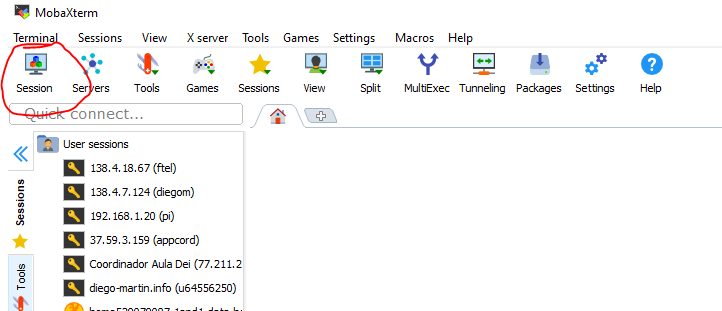
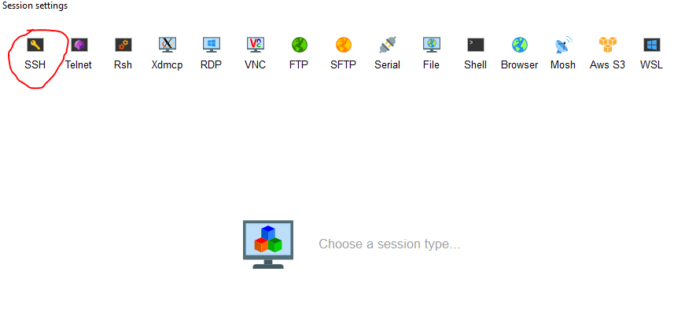
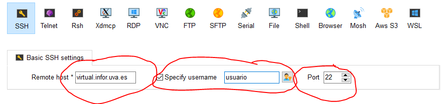

# FTI: 📘 Manual de instalación del servidor personal en la nube

## 🔹 Introducción  

En este manual aprenderás a configurar y desplegar el servidor personal en la nube, utilizando herramientas esenciales como [SSH](https://es.wikipedia.org/wiki/Secure_Shell) y [MobaXterm](https://mobaxterm.mobatek.net/). El objetivo es proporcionarte una guía paso a paso que te permita:  

1️⃣ **Acceder a tu máquina virtual** mediante SSH y MobaXterm.  
2️⃣ **Crear una estructura de directorios** adecuada para alojar el servicio web.  
3️⃣ **Instalar y configurar un servidor web** basado en **Node.js** y **Express**.  
4️⃣ **Usar PM2** para gestionar la ejecución del servicio de forma eficiente.  
5️⃣ **Descargar el código del servidor** desde un repositorio de GitHub y ponerlo en marcha.  
6️⃣ **Configurar el servidor** con los puertos adecuados y la ruta de acceso.  
7️⃣ **Configurar la API REST** y probarla.  

Al finalizar este manual, serás capaz de gestionar un servidor web básico en una máquina virtual, lo que te servirá como base para futuros desarrollos y despliegues en entornos reales.


## ⚠️ **AVISO IMPORTANTE** ⚠️  

Las máquinas virtuales proporcionadas son exclusivamente para uso docente en la asignatura **Fundamentos de las Tecnologías de la Información (FTI)** o fines puramente docentes e instructivos.  

**Cualquier uso indebido o no autorizado será sancionado de manera inmediata con un suspenso automático en la asignatura, sin excepciones.**  

Además, **si se detecta un uso malintencionado o ilegal, se procederá a la denuncia correspondiente ante las autoridades académicas y, si es necesario, ante las autoridades legales competentes.**  

🔍 Los profesores monitorizamos activamente el uso de las máquinas virtuales, así como todo el equipo informático que hay detrás, para garantizar el correcto funcionamiento y la seguridad del servicio.

No hay advertencias ni segundas oportunidades. 

<p align="center"> ⚠️ 🔴 <strong><span style="font-size: 2em;">Usa estos recursos con responsabilidad</span></strong> 🔴 ⚠️ </p>

## 🌐 Servidor Virtual: Acceso y Configuración  

Cada estudiante dispone de una **máquina virtual** (VM) preconfigurada con los recursos necesarios para alojar su servicio web. Estas máquinas están accesibles a través de Internet y permiten tanto la gestión remota mediante [SSH](https://es.wikipedia.org/wiki/Secure_Shell) como la visualización del servicio web desde un navegador.  

## 📡 Conexión a la Máquina Virtual  

Para acceder a tu máquina virtual (**VM**), necesitas utilizar **[SSH](https://es.wikipedia.org/wiki/Secure_Shell)** o un programa con interfaz gráfica para gestionar conexiones **SSH**. Recomendamos [MobaXterm](https://mobaxterm.mobatek.net/) por su facilidad de uso, versatilidad y compatibilidad con todos los sistemas operativos.  

### 🔑 Información de conexión  

Para conectarte a la VM, necesitarás los datos de acceso que te han sido proporcionados por correo electrónico:  

- **🌍 Dirección URL** → Se usa tanto para la conexión **SSH** como para acceder al servicio web vía **HTTP**.  
- **🔐 Puerto SSH** → Necesario para establecer una conexión segura con la VM.  
- **🌐 Puerto HTTP** → Permite visualizar el servicio web desde un navegador.  
- **🔑 Contraseña** → De inicio siempre será: `cambialaclaveya`. Esto significa que debes cambiarla cuanto antes.

⚠️ **Importante**:  
1. Si no tienes esta información, contacta con tu profesor para que te la proporcione.  
2. **No confundas el puerto SSH con el puerto HTTP**:  
   - **SSH** se usa para conectarte a la consola de la VM y administrar el sistema.  
   - **HTTP** es para acceder al servicio web alojado en la VM desde un navegador.  

### 🔑 Conexión mediante SSH  

Podemos conectarnos a la máquina virtual mediante SSH, ya sea por línea de comandos (usando **SSH**) o usando un programa como **MobaXterm**. Primero veremos la conexión por línea de comandos y después con **MobaXterm** (recomendado).

#### 1️⃣ Conexión por Línea de Comandos

En **Linux/macOS**, no necesitas instalar nada, ya que [SSH](https://www.ssh.com/academy/ssh) viene preinstalado.  
En **Windows**, puedes usar [Git Bash](https://git-scm.com/downloads), que incluye SSH, aunque es probable que ya lo tengas instalado.

🔹 **Paso 1: Abrir la terminal**  
En Linux/macOS, usa **Terminal**.  
En Windows, abre **Git Bash** o la **Consola de Windows (cmd/PowerShell)**.

🔹 **Paso 2: Conectarte a la máquina virtual**  
Ejecuta el siguiente comando, reemplazando los valores según tu configuración:

> ⚠️ **Nota sobre redes (eduroam / WiFi públicas)**: se recomienda hacer la conexión SSH desde una red “estable” (WiFi de casa, oficina o por cable). Ten en cuenta que muchas redes (especialmente **eduroam**) y algunas WiFis públicas (residencias de estudiantes, aeropuertos, hoteles, etc.) **pueden bloquear puertos que no sean “well-known”**. En la conexión SSH para el servidor personal en la nube de FTI el **puerto no es estándar**, la conexión puede fallar si la red lo filtra. Si te ocurre, prueba otra red.

```sh
ssh -p PUERTO_SSH usuario@virtual.infor.uva.es 
```

📌 **Parámetros a modificar**:  
- **PUERTO_SSH**: Número de puerto para la conexión SSH.  

📌 **Parámetros que NO DEBES modificar**:  
- **usuario**: debes dejar literalmente `usuario`.
- **virtual.infor.uva.es**: debes dejar literalmente `virtual.infor.uva.es`.


### 🔐 Primera conexión: aceptar la clave del servidor  
Si es la primera vez que te conectas, SSH te pedirá que confirmes la autenticidad del servidor con un mensaje similar a:

```
Are you sure you want to continue connecting (yes/no/[fingerprint])?
```

✅ Escribe `yes` y presiona `Enter`.


### 🔑 Introducir la contraseña  
- Después, se te pedirá la contraseña. La contraseña inicial es `cambialaclaveya`.
- Escríbela y presiona `Enter`.

⚠ **IMPORTANTE:**  
- No verás asteriscos ni caracteres al escribir la contraseña.  
- Esto es completamente normal en SSH.  
- Solo escribe tu contraseña y presiona `Enter`.  
- No olvides cambiar tu contraseña en cuanto te conectes. Para ello debes usar el comando `passwd` y seguir las instrucciones. Debes elegir una contraseña robusta, segura y no repetida.
- Si alguien entra en su servidor y hace algo malintencionado, la responsabilidad recaerá sobre ti.

Si tienes una respuesta por consola con el siguiente aspecto:

```sh   
Last login: Tue Feb 11 10:38:10 2026 from 157.88.80.82
usuario@labFTI-10:~$ 
```

¡Felicidades! ¡Ya estás conectado a tu máquina virtual! 🎉

### 2️⃣ Conexión con MobaXterm

[MobaXterm](https://mobaxterm.mobatek.net/) es una herramienta para todos los sistemas operativos que facilita la conexión remota mediante **SSH** con una interfaz gráfica avanzada.

🔹 **Paso 1: Descargar e instalar MobaXterm**  
Si aún no lo tienes instalado, descarga la versión **Home Edition** desde su [página oficial](https://mobaxterm.mobatek.net/download.html) y además proponemos descargar, siempre que se pueda, la versión portable, ya que la podemos instalar en un pendrive.

🔹 **Paso 2: Abrir MobaXterm**  
Ejecuta **MobaXterm** y accede a la pantalla principal.

🔹 **Paso 3: Crear una nueva sesión SSH**  
1. Haz clic en **Session** (sesión) en la parte superior izquierda.  

<div align="center">
    
</div>

2. Selecciona **SSH**.  
<div align="center">
    
</div>

3. En **Remote host**, introduce la dirección de la máquina virtual:  
   ```
   virtual.infor.uva.es
   ```
3. En **Specify username**, introduce `usuario`.  
4. En **Port**, introduce el **PUERTO_SSH** correspondiente.  

<div align="center">
    
</div>

5. Haz clic en **OK** para guardar y conectar.

### 🔐 Primera conexión: aceptar la clave del servidor  [No siempre ocurre este paso.]
Si es la primera vez que te conectas, MobaXterm te pedirá que confirmes la autenticidad del servidor con un mensaje similar a:

```
Host key verification failed. Do you want to continue? (Yes/No)
```

✅ Selecciona **Yes** para continuar.

### 🔑 Introducir la contraseña  
Cuando se solicite, introduce tu contraseña y presiona `Enter`.  (La primera contraseña es `cambialaclaveya`, pero debes cambiarla en cuanto te conectes)
⚠ **Recuerda:** No se mostrarán caracteres mientras la escribes, pero se está registrando.


Te pedirá si quieres guardar tu contraseña para acceder al servicio. Es buena idea tenerla guardada para no tener que reescribirla constantemente. Pero si eres un freak de la seguridad, no lo hagas.


Si ves un mensaje como este en la terminal integrada de MobaXterm:

```sh
     ┌────────────────────────────────────────────────────────────────────┐
     │                        • MobaXterm 25.0 •                          │
     │            (SSH client, X-server and networking tools)             │
     │                                                                    │
     │ ➤ SSH session to usuario@vpn.infor.uva.es                         │
     │   • SSH compression : ✔                                            │
     │   • SSH-browser     : ✔                                            │
     │   • X11-forwarding  : ✔  (remote display is forwarded through SSH) │
     │   • DISPLAY         : ✔  (automatically set on remote server)      │
     │                                                                    │
     │ ➤ For more info, ctrl+click on help or visit our website           │
     └────────────────────────────────────────────────────────────────────┘

[Muchos datos de la conexión]


Last login: Tue Feb 11 10:38:10 2026 from 157.88.80.82
usuario@labFTI-10:~$
```

¡Felicidades! 🎉 Ya estás conectado a tu máquina virtual.

Como podrás comprobar, tienes un panel a la izquierda que te permite subir y bajar archivos, lo cual es muy útil e interesante cuando estamos trabajando con servidores remotos.

No olvides cambiar tu contraseña nada más entrar con el comando `passwd` y seguir las instrucciones.

## 🔹 **Ejecutando comandos en una consola remota por SSH** 🧑‍💻  

Una vez conectado a la máquina virtual a través de SSH, puedes ejecutar comandos como si estuvieras trabajando en una terminal local de Linux. Sin embargo, hay algunas diferencias en la forma en que se copian y pegan textos, dependiendo del sistema operativo y la herramienta utilizada.

---

### 📋 **Copiar y pegar en una consola SSH**  

El manejo del **portapapeles** en una conexión SSH puede variar dependiendo de si estás usando **Windows**, **Linux** o **macOS**, así como si te conectas desde una terminal de comandos o desde **MobaXterm**.

### **📌 En Windows (MobaXterm y Git Bash)**
✅ **Para copiar texto desde la consola remota:**  
- Solo necesitas **seleccionar** el texto con el ratón.  
- Automáticamente se copia al portapapeles.  No es necesario pulsar **Ctrl + C**.

✅ **Para pegar texto en la consola remota:**  
- Basta con **hacer clic con el botón derecho** del ratón.  
- El contenido del portapapeles se pegará en la terminal.  No es necesario pulsar **Ctrl + V**.

💡 **Nota:** En algunos casos, **Ctrl + V no funciona** en una terminal SSH en Windows.  

---

### **📌 En Linux/macOS (Terminal nativa)**
✅ **Para copiar texto desde la consola remota:**  
- Usa **Ctrl + Shift + C** o **Cmd + C** (en macOS) para copiar.  

✅ **Para pegar texto en la consola remota:**  
- Usa **Ctrl + Shift + V** o **Cmd + V** (en macOS) para pegar.  
- Alternativamente, puedes hacer clic derecho y seleccionar **Pegar**.  

💡 **Nota:** En macOS/Linux, seleccionar texto no lo copia automáticamente al portapapeles como en MobaXterm en Windows.


## 🐧 Comandos básicos de Linux

En este apartado, vamos a ver los comandos esenciales de Linux que necesitaremos para instalar y desplegar nuestro servidor web. Si quieres profundizar más, puedes consultar [este manual completo de comandos Linux](https://linuxcommand.org/).

## 📂 Gestión de directorios y archivos  

- `ls` – Lista los archivos y directorios en la ubicación actual.  
  ```bash
  ls -l
  ```
- `cd <directorio>` – Cambia al directorio especificado.  
  ```bash
  cd /home/usuario/proyecto
  ```
- `mkdir <nombre>` – Crea un nuevo directorio.  
  ```bash
  mkdir mi_carpeta
  ```
- `rm <archivo>` – Elimina un archivo.  
  ```bash
  rm archivo.txt
  ```
- `rm -r <directorio>` – Borra un directorio y su contenido.  
  ```bash
  rm -r mi_carpeta
  ```
- `cp <origen> <destino>` – Copia archivos o directorios.  
  ```bash
  cp archivo.txt copia.txt
  ```
- `mv <origen> <destino>` – Mueve o renombra archivos.  
  ```bash
  mv archivo.txt nuevo_nombre.txt
  ```

## 🌐 Conexión y redes  

- `ping <host>` – Comprueba la conectividad con otro equipo.  
  ```bash
  ping google.com
  ```
- `curl <URL>` – Realiza peticiones a una URL.  
  ```bash
  curl https://example.com
  ```
- `wget <URL>` – Descarga un archivo desde una URL.  
  ```bash
  wget https://ejemplo.com/archivo.zip
  ```


## 📌 Instalación de Node.js, NPM y PM2  

En este apartado explicaremos cómo instalar y utilizar **Node.js**, **NPM** y **PM2** en una máquina remota para desplegar un servicio web de manera eficiente y persistente.

## 🔹 ¿Qué es Node.js?  
[Node.js](https://nodejs.org/) es un entorno de ejecución para JavaScript del lado del servidor basado en el motor V8 de Chrome. Permite ejecutar código JavaScript fuera del navegador, lo que lo hace ideal para construir aplicaciones web escalables y rápidas.  

Lo utilizaremos para ejecutar nuestro servidor web basado en **Express.js**.

## 🔹 ¿Qué es NPM?  
[NPM (Node Package Manager)](https://www.npmjs.com/) es el gestor de paquetes de Node.js. Nos permite instalar librerías y herramientas necesarias para nuestro proyecto.  

Lo usaremos para instalar las dependencias de nuestro servidor web.

## 🔹 ¿Qué es PM2?  
[PM2](https://pm2.keymetrics.io/) es un gestor de procesos para Node.js que nos permite ejecutar, monitorear y mantener en ejecución nuestras aplicaciones incluso después de un reinicio del sistema.  

Las aplicaciones se caen, hay errores, excepciones... ¿qué te voy a contar? 😅

Para que el servicio esté ejecutado a pesar de estas interrupciones. Emplearemos PM2 para asegurarnos de que nuestro servidor web siga activo en segundo plano.

---

## 🛠 Instalación de Node.js y NPM  
### 📌 Verificando si ya está instalado  
Antes de instalar, revisemos si **Node.js** y **NPM** están disponibles en nuestro sistema:  

```sh
node -v
npm -v
```

Si estos comandos devuelven un número de versión, significa que ya están instalados.

### 📌 Instalación en Ubuntu  
Ejecutamos los siguientes comandos para instalar la última versión estable de Node.js y NPM. Seguramente te pida confirmación de la **contraseña**.


<!-- Si entro en esta web: obtengo la versión más moderna
https://deb.nodesource.com/
-->

```sh
curl -fsSL https://deb.nodesource.com/setup_22.x | sudo -E bash -
sudo apt install -y nodejs
```

Verificamos la instalación nuevamente:

```sh
node -v
npm -v
```

Debería devolver la versión de Node.js y NPM respectivamente, confirmando que la instalación fue exitosa.


```sh
usuario@labFTI:~$ node -v
npm -v
v22.22.0
10.9.4

```


---

## 🛠 Instalación de PM2  
Una vez instalado Node.js y NPM, podemos instalar **PM2** con el siguiente comando usando NPM:

```sh
sudo npm install -g pm2
```

Verificamos que PM2 está correctamente instalado con:

```sh
pm2 -v
```

Con este comando obtendrás un número de versión que confirma que PM2 se ha instalado correctamente. Y además un pequeño manual de uso de PM2.

Con esto, ya tenemos un entorno listo para ejecutar nuestro servicio web de forma persistente. 🚀

## 🌍 Instalación del **Servidor Web FTI**  

En esta sección explicaremos la instalación de un servidor web ligero para servir archivos estáticos y su mantenimiento.  

## 📌 Características  

- 📂 Sirve archivos solo desde `html/` y sus subdirectorios (`css/`, `js/`, `img/`).  Por defecto, está el laboratorio 3 de CSS.
- 📡 Registra cada conexión en la consola.  
- 🚀 Fácil de ejecutar y configurar.  
- 🔄 Se mantiene en ejecución con [PM2](https://pm2.keymetrics.io/) para mayor estabilidad.  

## 🛠️ Instalación  

### 1️⃣ Clonar el repositorio  
Para obtener el código fuente, ejecuta:  

```sh
git clone https://github.com/DiegoMartindeAndres/servidor-FTI
```

Con esto, estás clonando el repositorio de GitHub del servidor web FTI en tu máquina remota para poder empezar a trabajar con él.

### 2️⃣ Acceder al directorio del proyecto  
```sh
cd servidor-FTI/
```

### 3️⃣ Instalar dependencias  
El servidor utiliza Node.js y Express. Instala todas las dependencias ejecutando:  

```sh
npm install
```

### 4️⃣ Configurar PM2 (Opcional pero Recomendado)  
Vamos a usar PM2 para mantener nuestro servidor en ejecución, incluso después de cerrar la conexión [SSH](https://www.ssh.com/academy/ssh). Para iniciar el servidor con PM2, ejecuta:  

```sh
pm2 start index.js --name servidor-FTI
```

Este comando inicia el servidor y lo nombra como `servidor-FTI` para una fácil identificación.


Enhorabuena!! ¡Tu servidor web ya está en marcha! 🎉

Puedes acceder desde cualquier navegador a la URL:

```
http://virtual.infor.uva.es:PUERTO_HTTP/abcd1234
```

Debes sustituir `PUERTO_HTTP` por el puerto que te ha sido concedido para el servicio web. Y `abcd1234` es la ruta por defecto para acceder a tu servidor y debes renombrarlo por la ruta que se te ha asignado, renombrando el directorio que tienes en `html/` por la ruta que se te ha asignado. Con el siguiente comando puedes renombrar el directorio:

```sh
mv html/abcd1234 html/RUTA
``` 

Para ver los servidores en ejecución, usa:

```sh
pm2 list
```

Se te mostrará una tabla con los servidores en ejecución y su estado. Si está vacía significa que no tendrás nada en ejecución. Y lo ideal es que solo tengas un servidor en ejecución, el servidor-FTI, para evitar confusiones.

Para asegurarte de que se inicie automáticamente tras un reinicio del sistema:  

```sh
pm2 startup
pm2 save
```

### 🔴 Apagar un servicio en PM2  
Si en algún momento necesitas detener el servidor, puedes hacerlo con:

```sh
pm2 stop servidor-FTI
```

Si deseas eliminarlo completamente de la lista de procesos de PM2:

```sh
pm2 delete servidor-FTI
```

Esto asegurará que el servicio no se reinicie automáticamente después de un reinicio del sistema.

### 5️⃣ Iniciar el servidor manualmente (sin usar PM2)
Si no usas PM2, puedes ejecutar el servidor directamente con:  

```sh
node index.js
```

Esta opción está bien para hacer pruebas, pero recuerda que si cierras la conexión SSH, el servidor se detendrá.

## 📁 Estructura del Proyecto  

```
servidor-FTI/
│── index.js               # Archivo principal del servidor
│── package.json           # Configuración del proyecto
│── html/RUTA              # Carpeta pública
│        │── index.html    # Página principal
│        │── css/          # Hojas de estilo
│        │── js/           # Scripts
│        │── img/          # Imágenes
```

## 🌐 Acceso al Servidor  

Una vez en ejecución, el servidor estará disponible en:  

```
http://virtual.infor.uva.es:PUERTO_HTTP/RUTA
```


🎉 ¡El Último Paso hacia la Gloria! 🎉

🔹 No olvides reemplazar PUERTO_HTTP por el puerto que te ha sido concedido.

Ha llegado el momento de la verdad. Abre tu navegador y accede a la URL correspondiente.

Si en tu pantalla aparece tu web funcionando a la perfección...

🌟 ¡ENHORABUENA! Has conquistado este manual con éxito. 🌟

🚀 ¡Ahora eres el maestro de tu propio servidor web! 


<div align="center">
    
</div>


## 🔧 Personalización  

Puedes agregar más archivos dentro de `html/` y sus subdirectorios (`css/`, `js/`, `img/`), y el servidor los servirá automáticamente.  


## 🔧 Configurar la API REST 🧩

Nuestro servidor web también incluye una API Rest para gestionar entidades. Para configurarla correctamente, sigue estos pasos:

1. **Editar el fichero index.js**: OJO! no confundir con el `index.html` de la práctica.
   
   1. Abre el fichero `index.js` en un editor de texto. Podéis hacerlo con nano, que es un editor de texto en consola, con el siguiente comando:

      ```sh
      nano index.js
      ```
   2. Busca la línea que contiene `const RUTA_API = '/abcd1234/api/entidades';` 
   3. Sustituye `abcd1234` por la ruta que te haya sido asignada. Por ejemplo, si tu ruta es `a1b2c3d4`, la línea quedaría así: `const RUTA_API = '/a1b2c3d4/api/entidades';`
   4. Guarda los cambios.
2. **Parar el servidor y volver a arrancar**: Esto ya deberías saberlo hacer. Si estás usando PM2, puedes hacerlo con los siguientes comandos:

   ```sh
   pm2 stop servidor-FTI
   pm2 start servidor-FTI
   ```

   Si estás ejecutando el servidor manualmente con `node index.js`, simplemente detén el proceso (con Ctrl + C) y vuelve a ejecutarlo.

3. **Haz una prueba**: accediendo a la URL de tu servidor web en el navegador. Deberías ver la página de inicio del servidor de FTI.
4. **Acceder a tu servidor**: Para acceder a tu práctica, abre el navegador y escribe la siguiente URL:

    ```
    http://virtual.infor.uva.es:<puerto_http>/abcd1234/api/entidades
    ```

   * Debes sustituir `<puerto_http>` por el puerto que se te ha asignado para acceder al servidor web. 
   * Debes cambiar `abcd1234` por el valor que te haya sido asignado.

    Si todo ha ido bien, deberías ver un JSON con la lista de entidades de ejemplo, que deberás cambiar, pero eso se explica más adelante.


## 🧾 Tabla resumen de la API que proporciona el servidor personal en la nube

| Verbo HTTP | Ruta                          | Parámetros               | Acción        | Código respuesta | Descripción                                  |
| ---------- | ----------------------------- | ------------------------ | ------------- | ---------------- | -------------------------------------------- |
| GET        | `/abcd1234/api/entidades`     | —                        | Obtener todas | 200              | Devuelve todas las entidades en formato JSON |
| GET        | `/abcd1234/api/entidades/:id` | `id` (URL)               | Obtener una   | 200 / 404        | Devuelve una entidad por ID                  |
| POST       | `/abcd1234/api/entidades`     | JSON body `{id, nombre}` | Crear         | 201 / 400        | Crea una nueva entidad                       |
| DELETE     | `/abcd1234/api/entidades/:id` | `id` (URL)               | Eliminar      | 200 / 404        | Borra una entidad por ID                     |

### Nota sobre las entidades

En un entorno profesional real, lo habitual sería que nuestro servidor no trabajase con un fichero local, sino que estuviese conectado a una **base de datos**.

Para este tipo de aplicaciones suelen utilizarse bases de datos **NoSQL**, especialmente cuando trabajamos con APIs REST y datos en formato JSON. Algunos ejemplos muy utilizados en la industria son:

* 🟢 **MongoDB** – Base de datos documental muy popular en entornos Node.js.
* 🔴 **Redis** – Base de datos en memoria, muy rápida, ideal para caché o datos temporales.
* 🔵 **Cassandra** – Pensada para grandes volúmenes de datos distribuidos.
* 🟣 **CouchDB** – Base de datos documental basada en JSON.
* 🟡 **Firebase Firestore** – Base de datos NoSQL en la nube. [Esta BBDD la usaremos en la asignatura optativa Plataformas de Software Móvil de tercero]
* 🟠 **DynamoDB** – Servicio NoSQL gestionado de AWS.

En todos estos casos, los datos se almacenan de forma estructurada y eficiente, permitiendo búsquedas rápidas, indexación, escalabilidad y concurrencia entre múltiples usuarios.

---

### 📂 ¿Qué hacemos nosotros en este servidor?

En nuestro caso, para simplificar la instalación y evitar dependencias adicionales, la información se lee desde un fichero que está en la raíz del servidor y que se llama:

```
entidades.json
```

En el ejemplo proporcionado, este fichero contiene **4 entidades** relacionadas con **atracciones turísticas**.

El servidor:

* 🔎 Solo realiza búsquedas por el campo `id`.
* 🧱 Permite que cada entidad tenga los atributos que queramos.
* 💾 Almacena los datos directamente en memoria tras leer el fichero.

Es decir, si añadimos más atributos (por ejemplo `descripcion`, `ciudad`, `pais`, `precio`, etc.), el servidor los aceptará y los devolverá en el JSON sin necesidad de modificar la estructura.

---

### ⚠️ ¿Es esto eficiente?

No especialmente.

Trabajar con ficheros planos como almacenamiento principal:

* ❌ Es **ineficiente** cuando tenemos cientos, miles o millones de registros.
* ❌ No permite indexación avanzada.
* ❌ No está pensado para accesos concurrentes.
* ❌ No escala bien en entornos reales.

Sin embargo…

Para nuestro servidor docente y para entender cómo funciona una API REST básica, esta solución es:

* ✅ Sencilla
* ✅ Fácil de entender
* ✅ Fácil de desplegar
* ✅ Sin dependencias externas

Y para los objetivos de la asignatura **FTI**, es más que suficiente 🚀

## 📜 Licencia  

Este proyecto está bajo la licencia [MIT](LICENSE).  
